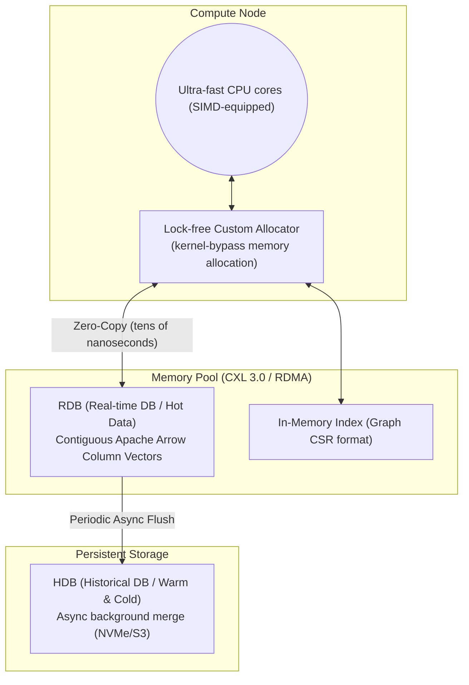

# Layer 1: Storage Engine & Global Shared Memory Pool (DMMT)

This document is the detailed design specification for the **Disaggregated Memory MergeTree (DMMT)** layer, the most critical component of the in-memory DB.

## 1. Architecture Diagram

## 2. Tech Stack
- **Language:** Modern C++20 (utilizing `std::pmr` polymorphic memory resources)
- **Memory technology:** Linux HugePages (minimize TLB misses), RAM Disk (tmpfs), NUMA-aware allocation.
- **Distributed/network memory:** CXL 3.0, **UCX (Unified Communication X)** abstraction layer (auto-switching from on-premises RoCE v2/InfiniBand to AWS EFA and Azure InfiniBand without hardware dependency).
- **Data format:** Apache Arrow data specification (C Data Interface compatible).

## 3. Layer Requirements
1. **OS Independence (Kernel Bypass):** Must not call OS `Syscall` (e.g., `read`, `write`, `mmap`) for data storage and retrieval; must directly manage custom memory regions at the application level.
2. **Columnar Continuity Guarantee:** Collected tick data must be contiguously allocated in pure array units perfectly aligned to cache-line size, preventing pointer-chasing latency.
3. **Non-Stop Background Merge (MergeTree):** Continuously monitor memory saturation and, upon reaching the threshold, asynchronously export compressed historical data to NVMe storage (HDB) without locking.

## 4. Detailed Design
- **Memory Arena technique:** The RDB pre-allocates a large memory space (Pool) via CXL/RDMA (Arena). Rather than dynamically allocating memory (`malloc`/`new`) for each incoming tick, the arena's empty pointer is atomically updated (bump pointer), making allocation cost zero.
- **Partitioning:** Data is divided into partition chunks by `Symbol` and `Hour`. Each chunk becomes a target for HDB flush when it transitions to read-only state.
