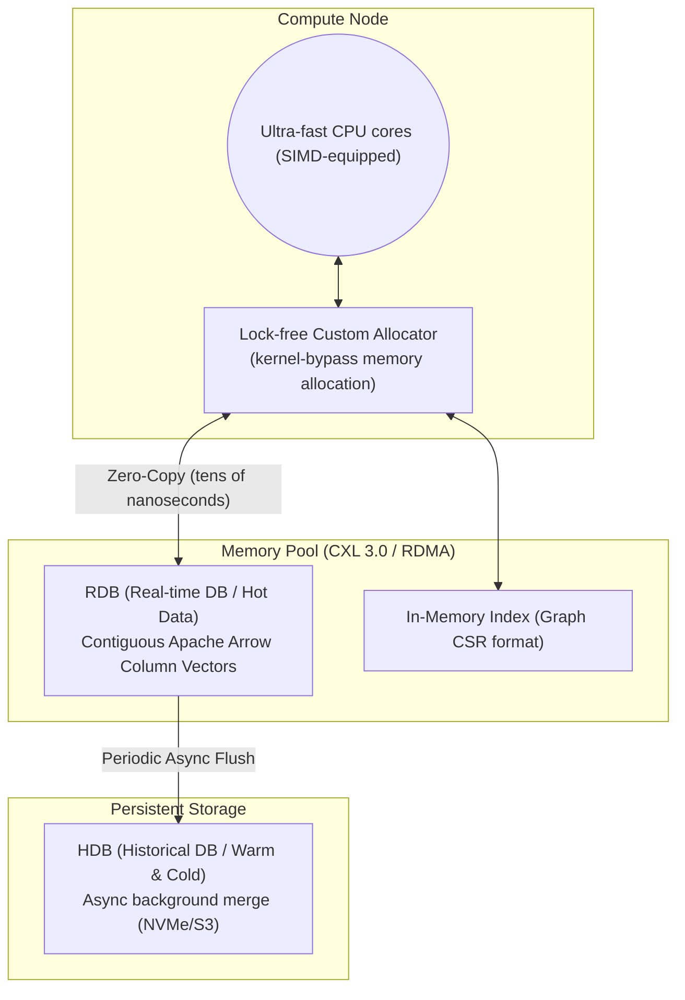

# Layer 1: Storage Engine & Global Shared Memory Pool (DMMT)

This document is the detailed design specification for the **Disaggregated Memory MergeTree (DMMT)** layer, the most critical component of the in-memory DB.

## 1. Architecture Diagram



## 2. Tech Stack
- **Language:** Modern C++20 (utilizing `std::pmr` polymorphic memory resources)
- **Memory technology:** Linux HugePages (minimize TLB misses), RAM Disk (tmpfs), NUMA-aware allocation.
- **Distributed/network memory:** CXL 3.0, **UCX (Unified Communication X)** abstraction layer (auto-switching from on-premises RoCE v2/InfiniBand to AWS EFA and Azure InfiniBand without hardware dependency).
- **Data format:** Apache Arrow data specification (C Data Interface compatible).

## 3. Layer Requirements
1. **OS Independence (Kernel Bypass):** Must not call OS `Syscall` (e.g., `read`, `write`, `mmap`) for data storage and retrieval; must directly manage custom memory regions at the application level.
2. **Columnar Continuity Guarantee:** Collected tick data must be contiguously allocated in pure array units perfectly aligned to cache-line size, preventing pointer-chasing latency.
3. **Non-Stop Background Merge (MergeTree):** Continuously monitor memory saturation and, upon reaching the threshold, asynchronously export compressed historical data to NVMe storage (HDB) without locking.

## 4. Detailed Design
- **Memory Arena technique:** The RDB pre-allocates a large memory space (Pool) via CXL/RDMA (Arena). Rather than dynamically allocating memory (`malloc`/`new`) for each incoming tick, the arena's empty pointer is atomically updated (bump pointer), making allocation cost zero.
- **Partitioning:** Data is divided into partition chunks keyed by `(table_id, symbol_id, hour_epoch)`. `table_id` (uint16_t) is assigned by `SchemaRegistry` on `CREATE TABLE` (0 is reserved for the legacy single-table path), so every table has its own partition space and `SELECT * FROM empty_table` never returns rows from other tables. Each chunk becomes a target for HDB flush when it transitions to read-only state. See devlog 082 (initial design) and devlogs 083–085 (full-sweep closure: HDB v2 header, `_schema.json` durability, table-aware ingress/cluster routing, strict SQL fallback) for the implementation.

## 5. Partition Attribute Hints (kdb+ `s#`/`g#`/`p#` equivalent)

ZeptoDB supports per-column attribute hints that allow the query executor to use index structures instead of linear scans.

### 5.1 `s#` — Sorted Attribute

**Status:** ✅ Implemented (2026-03-23)

Marks a column as monotonically non-decreasing (append-only guarantee). Enables O(log n) binary search instead of O(n) linear scan for range predicates.

**API:**
```cpp
Partition* part = ...;
part->set_sorted("price");               // mark as sorted
bool ok = part->is_sorted("price");      // query attribute

auto [begin, end] = part->sorted_range("price", 15000, 16000);
// begin/end are row indices [begin, end) satisfying 15000 <= price <= 16000
```

**Implementation:** `include/zeptodb/storage/partition_manager.h`
- `sorted_columns_` (`unordered_set<string>`) stored per partition
- `sorted_range()` uses `std::lower_bound` / `std::upper_bound` on the column span

**Executor Integration:** `src/sql/executor.cpp` — `extract_sorted_col_range()`
- Scans WHERE clause for BETWEEN / `>=` / `>` / `<=` / `<` / `=` on sorted columns
- Fires in `exec_simple_select` (SELECT without aggregation)
- Falls through to `eval_where_ranged(stmt, *part, r_begin, r_end)` — only scans the pruned range

**SQL example:**
```sql
-- With s# on price column: O(log n) binary search, not O(n) full scan
SELECT price, volume FROM trades
WHERE price BETWEEN 15000 AND 16000;
```

**Benchmark:** For 1M rows, a 1% selectivity range filter reduces rows_scanned from 1,000,000 → ~10,000.

### 5.2 `g#` — Grouped (Hash) Attribute

**Status:** Planned

Hash index for low-cardinality columns (e.g., exchange_id, side). O(1) equality lookup.

### 5.3 `p#` — Parted Attribute

**Status:** Planned

Similar to `g#` but with contiguous memory layout per group — enables range skip on a partitioned column.

## 6. Time Range Index

**Status:** ✅ Implemented

Timestamps within each partition are monotonically increasing (append-only). The executor uses `timestamp_range(lo, hi)` (O(log n) binary search) and `overlaps_time_range(lo, hi)` (O(1) partition skip) automatically for `WHERE timestamp BETWEEN ...` clauses.

Related code: `Partition::timestamp_range()`, `Partition::overlaps_time_range()`, `QueryExecutor::extract_time_range()`

## 7. RDB Snapshot and Recovery Boundary

**Status:** Graceful-restart path implemented; abrupt-crash durability is not
promoted (hardened 2026-07-19).

### 7.1 Generation publication

`FlushManager` writes every non-empty RDB partition, including ACTIVE
partitions, into a new immutable generation. It publishes that generation only
after every column succeeds:

```text
{snapshot_path}/
  CURRENT
  generations/
    gen-{time}-{pid}-{sequence}/
      _COMPLETE
      {symbol_id}/{hour_epoch}/{column}.bin
      t{table_id}/{symbol_id}/{hour_epoch}/{column}.bin
```

`_COMPLETE` records the generation name plus its partition and row totals.
`CURRENT` is written to a temporary file and renamed after `_COMPLETE` exists.
A partially written generation is therefore never mixed with the previously
published generation. The previous generation is retained during cleanup.

Column files use the HDB v2 format. Each column is also written to a unique
temporary file and renamed, and snapshot writing pins the partition set, then
holds each partition write lock while verifying that every column has the same
non-zero row count and a valid type. Create/evict operations may proceed while
pinned objects remain alive. Periodic snapshots are per-partition consistent,
not a cross-partition transactional point-in-time cut.

```cpp
FlushConfig flush;
flush.enable_auto_snapshot = true;
flush.snapshot_interval_ms = 60'000;
flush.snapshot_path = "/var/lib/zeptodb/_rdb_snapshots";
```

`ZeptoPipeline::stop()` stops the flush worker, joins the drain workers, drains
the remaining ingest queue, and then publishes one final generation. It returns
`false` if that final publication fails. An empty final generation is valid and
supersedes older non-empty state. Embedders must quiesce external producers
first; the HTTP server stops its listener before it stops the pipeline.

### 7.2 Fail-closed recovery

With `PipelineConfig::enable_recovery`, `start()` resolves only the generation
named by `CURRENT` before any worker starts. A referenced partial/corrupt
generation aborts startup; recovery does not silently skip a partition or fall
back to a different generation.

Validation includes:

- bounded `CURRENT` and `_COMPLETE` manifests and path-safe generation names;
- exact HDB header/payload sizes, supported compression/type values, and
  overflow-safe `row_count * element_size` checks;
- exact table id, required/only-expected columns, column types, equal row
  counts, canonical route directories, hour routing, and named `symbol`
  routing when the schema carries that column;
- exact recovered partition/row totals matching `_COMPLETE`.

Legacy table-id 0 tick partitions and schema-backed numeric, floating-point,
timestamp, and boolean tables are replayed into RDB. This makes their rows
visible to the normal `QueryExecutor` SQL path after a graceful restart.
Generation publication rejects `STRING`/`SYMBOL` columns, and recovery rejects
such columns in an existing generation, because the process-wide
`StringDictionary` does not yet have a durable snapshot format. Graceful stop
therefore reports failure instead of publishing a generation it cannot reload.

### 7.3 Explicit non-guarantees

- Column data and snapshot-directory renames are not followed by the complete
  file-and-directory `fsync` sequence needed for a power-loss guarantee.
- Column payloads do not carry checksums, so structurally valid silent bit
  corruption is outside the current detection guarantee.
- The ingestion WAL is not wired into this pipeline recovery path, so rows
  newer than the last successfully published generation can be lost on an
  abrupt process/node failure. No 60-second maximum-loss SLA is claimed.
- General SQL still does not merge arbitrary HDB-only partitions. Tiered
  pipelines therefore default `reclaim_after_flush` to `false`, reject
  `reclaim_after_flush=true`, and reject memory-limit eviction. Retained RDB
  rows trade bounded memory for query correctness until HDB merge lands.
- The schema catalog is persisted separately. Its own atomic validation is
  required, but snapshots are not a general multi-table transaction mechanism.
- A snapshot root has one pipeline writer. Publication does not coordinate
  multiple processes that share the same root.

### 7.4 Focused coverage

| Test | Evidence |
|------|----------|
| `HDBTest.GracefulStopSnapshotRestoresGeneralSqlRows` | SQL write, final stop snapshot, destroy/recreate, recovery, `COUNT` and `SUM` through `QueryExecutor` |
| `HDBTest.GracefulStopReportsSnapshotPublicationFailure` | A blocked snapshot path makes graceful stop return failure |
| `HDBTest.GracefulStopRejectsDictionarySnapshot` | Unsupported dictionary columns fail shutdown publication instead of creating an unrecoverable generation |
| `HDBTest.RecoveryRejectsCorruptPublishedGeneration` | Truncated referenced column aborts startup before workers start |
| `HDBTest.RecoveryIgnoresUnpublishedPartialGeneration` | An unreferenced partial generation cannot contaminate the published snapshot |
| `HDBTest.RecoveryRejectsUnexpectedPublishedContent` | Unexpected files/directories in a published generation fail recovery closed |
| `HDBTest.EmptyGracefulSnapshotSupersedesPriorState` | Empty generations publish and recover as empty |
| `HDBTest.TieredPipelineRejectsPostFlushReclaim` | Unsupported reclaim configuration fails at construction |
| `HDBTest.PipelineRejectsUnsafeDurabilityConfiguration` | Missing HDB path, tiered eviction, and zero snapshot intervals fail at construction |
| `HDBTest.SnapshotVisitorPinsPartitionAcrossConcurrentEviction` | Snapshot callbacks retain partition lifetime without blocking concurrent eviction |
| `HDBTest.SnapshotRejectsZeroFirstColumnWithNonEmptyPeer` | A malformed partition cannot masquerade as a valid empty snapshot |

---

## 8. HDB On-Disk Format — File Header (v1 / v2)

Each HDB column file starts with a fixed-size header.

| Version | Header size | Emitted by | Contains `table_id` | Read-compatible by |
|---------|-------------|------------|---------------------|--------------------|
| v1 | 32 bytes | Pre-devlog 083 writers | No (implicit `0`) | v1 & v2 readers |
| v2 | 40 bytes | Current writer (`HDB_VERSION = 2`) | Yes, `uint16_t` at offset 32 | v2 readers only |

v2 layout (`HDBFileHeader`, `sizeof == 40`):

```
offset  size  field
  0     5     magic[5] = "APEXH"
  5     1     version  = 2
  6     1     col_type (ColumnType)
  7     1     compression (0=None, 1=LZ4)
  8     8     row_count
 16     8     data_size
 24     8     uncompressed_size
 32     2     table_id            <-- v2 only
 34     6     reserved[6] (zero)
```

Readers dispatch on the `version` byte at offset 5: v1 files are read with a
32-byte header and `table_id` is forced to `0`; v2 files read the full 40 bytes.
The requested directory scope and header table id must match exactly. Readers
also reject unknown types/compression, zero or overflowing dimensions,
truncated/trailing payloads, and uncompressed-size/row-count disagreement
before exposing a span.

### 8.1 Directory Layout

| table_id | Directory pattern |
|----------|-------------------|
| `0` (legacy / single-table) | `{hdb_base}/{symbol_id}/{hour_epoch}/{col}.bin` |
| `> 0` (CREATE TABLE assigned) | `{hdb_base}/t{table_id}/{symbol_id}/{hour_epoch}/{col}.bin` |

`HDBWriter::partition_dir(table_id, symbol, hour)` is the canonical builder; a legacy single-argument overload delegates with `table_id = 0` and returns the pre-v2 layout so existing kdb+-style HDB roots remain readable.

## 9. SchemaRegistry Durability (`_schema.json`)

`SchemaRegistry` persists the catalog to `{hdb_base_path}/_schema.json` whenever a CREATE/DROP TABLE succeeds, so `table_id` assignments survive process restarts:

```json
{"next_table_id":4,
 "tables":[
   {"name":"trades","table_id":1,"ttl_ns":0,"has_data":1,
    "columns":[{"name":"price","type":0}, ...]},
   ...
 ]}
```

- **Save:** `ZeptoPipeline::save_schema_catalog()` is called from `QueryExecutor::exec_create_table` and `exec_drop_table` when `hdb_base_path` is non-empty. Write is `open + rename(2)` for crash-atomicity.
- **Load:** `ZeptoPipeline` constructor calls `SchemaRegistry::load_from()` after `HDBWriter` is built. `next_table_id_` is restored as `max(persisted next, max(loaded table_id) + 1)` so a new CREATE after restart never reuses a dropped id.
- **No dep:** Hand-rolled JSON (no `nlohmann/json`); all fields are scalars.
- **PURE_IN_MEMORY mode:** `hdb_base_path` is empty by default, so save/load are no-ops — matching the pre-existing ephemeral behavior.

See devlog 083 for the full Stage A changelog.

## 10. WAL forward-compatibility with `table_id` (Stage B — devlog 084)

`WALWriter::write` persists the raw 64-byte `TickMessage` (see
`include/zeptodb/ingestion/tick_plant.h`). Since devlog 082, `TickMessage`
includes `uint16_t table_id` within that 64-byte layout — **no WAL format
change is required for Stage B**:

- WAL files written *after* devlog 082 already carry the correct `table_id`
  on every record and replay losslessly.
- WAL files written *before* devlog 082 replay with the old byte layout; on
  modern readers, the bytes at the `table_id` offset are either zero (from
  pre-field padding) or ignored, giving the legacy path (`table_id = 0`).
- No forward-compat break: the 64-byte `static_assert` is unchanged, so
  older binaries reading newer WAL files still see exactly 64 bytes per
  record and simply ignore the `table_id` field they don't know about.

See devlog 084 for the full Stage B changelog.


## 11. Cold tier S3 Parquet sink (devlog 118)

The `FlushManager` Parquet path emits files to S3 via `S3Sink`. The S3 path
layout is now operator-selectable:

```
FLAT  (default, byte-identical to pre-118):
  s3://{bucket}/{prefix}/{symbol}/{hour_epoch}.parquet

HIVE  (recommended for external analytics):
  s3://{bucket}/{prefix}/year=YYYY/month=MM/day=DD/symbol={ID}/{ID}-{hour_epoch}[-{hash}].parquet
```

### Layout choice rationale

- **HIVE is the default for new deployments.** Athena, DuckDB, Polars, and
  Spark all auto-discover Hive-partitioned columns (`year=…/month=…/day=…/
  symbol=…`) without table DDL gymnastics — point the reader at the bucket
  and partition pruning works on day one. This is the operator-facing
  output of the cold-tier story (`docs/operations/COLD_TIER_S3.md`).
- **FLAT stays as the explicit opt-out** for environments that already
  consume the legacy `{symbol}/{hour}.parquet` shape and need byte-for-byte
  compatibility. `S3Layout::FLAT` is the C++ default, but every operator
  surface (Helm `coldTier.layout`, CLI `--cold-tier-layout`) defaults to
  HIVE.
- The HIVE date components are computed from `hour_epoch * 3600` seconds
  via `gmtime_r()` so the partitioning is UTC-stable across regions and
  daylight-saving boundaries. Month and day are zero-padded.

### Multi-pod path-collision protection

Two pods writing the same `(symbol, hour_epoch)` partition (e.g. during a
rebalance window or a stateless ingest tier) would otherwise produce two
files with the same key and the last writer would silently win.

`S3Sink` defends against that by appending a 4-char lower-case hex hash of
`gethostname()` to the HIVE filename:

```
year=2026/month=05/day=01/symbol=42/42-476256-a1b2.parquet
                                              ^^^^
```

The hash is computed once at `S3Sink` construction (FNV-1a 32-bit, low 16
bits emitted as 4 hex chars). If `gethostname()` fails or is unavailable
the suffix is omitted and the filename remains stable for that pod —
collisions are then theoretically possible but only across pods running on
the same hostname-less environment, which Linux EKS/EC2 does not produce
in practice. Unit tests force the suffix off via
`S3SinkConfig::disable_host_hash` for deterministic golden keys.

The conversion from the partition's nanosecond `hour_epoch` (the unit
`PartitionManager::to_hour_epoch` produces) to "hours since epoch" (the
unit `S3Sink::make_s3_key` consumes for HIVE) happens inside
`FlushManager::flush_partition_parquet`. FLAT keeps the byte-identical
nanosecond form for backward compat.

See devlog 118 and `docs/operations/COLD_TIER_S3.md` for the full operator
recipe (Helm + CLI + IAM + Athena/DuckDB/Polars/Spark read patterns).
