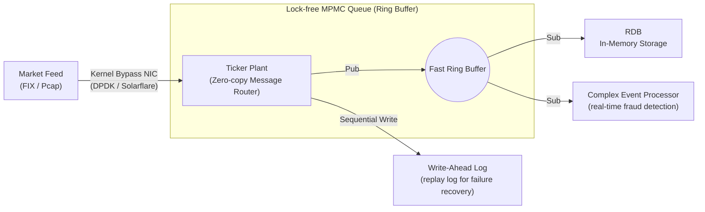

# Layer 2: Ingestion & Network Layer (Tick Plant)

This document is the detailed design specification for the **ultra-low latency routing backbone (Tick Plant)** layer, where network packets from external exchanges are received and distributed to the DB system.

## 1. Architecture Diagram



## 2. Tech Stack
- **Network packet processing:** DPDK, **UCX (Unified Communication X)** framework (open-source communication standard supporting RoCE v2, InfiniBand, AWS SRD without cloud vendor lock-in).
- **Queue and lock management:** C++20 Atomics (`std::memory_order_relaxed`), Rust (for memory safety in packet parsing).
- **Routing algorithm:** Multi-Producer Multi-Consumer (MPMC) Ring Buffer, Disruptor architecture-based event loop.

## 3. Layer Requirements
1. **Network OS Stack Bypass:** Discard the Linux TCP/IP stack and fetch data from the NIC (Network Interface Card) directly to software user-space buffers via polling, eliminating interrupt latency.
2. **Multi-Subscriber Broadcasting:** With a single packet reception, push data to multiple subscribers — storage (RDB), logging (WAL), pattern analysis (CEP) — in a zero-copy manner.
3. **Ordering Guarantee:** Every financial tick must be guaranteed strict microsecond-precision FIFO ordering and global timestamp stamping upon receipt.

## 4. Detailed Design
- **Ring Buffer-based Lock-Free Queue design:** Producer threads (Ticker Plant receive side) pre-claim the next write position on the Ring buffer via Atomic Fetch-and-Add. To fundamentally block Thread Context-switch and Mutex Lock, threads are fully pinned to a single CPU core (CPU Pinning) with spinlock or infinite polling loop.
- **Async separation of storage and parsing:** When data arrives, the Ticker Plant immediately writes to WAL in the most primitive form to ensure durability. It then immediately throws it into the RDB queue for async columnar format normalization and format assignment.

## 5. Apache Kafka Consumer

**Status:** Implemented (2026-03-23) — `include/zeptodb/feeds/kafka_consumer.h`, `src/feeds/kafka_consumer.cpp`

### Purpose

Connects enterprise Kafka data pipelines to ZeptoDB ingestion. Kafka is the dominant message bus in fintech, adtech, and e-commerce real-time systems. This integration allows any Kafka producer (market data feeds, event buses, IoT gateways) to stream ticks directly into ZeptoDB without an intermediate adapter.

### Architecture

```
Kafka Topic (librdkafka poll)
        ↓
KafkaConsumer::on_message(data, len)
        ↓
decode_json / decode_binary / decode_json_human
        ↓
ingest_decoded(TickMessage)
        ↓
  ┌─ router_ set?  ──→  PartitionRouter::route(symbol_id)
  │                        ├─ local  → ZeptoPipeline::ingest_tick()
  │                        └─ remote → TcpRpcClient::ingest_tick()
  └─ no router     ──→  ZeptoPipeline::ingest_tick()  (single-node)
```

### Wire Formats

| Format | Description | Use case |
|--------|-------------|----------|
| `JSON` | `{"symbol_id":1,"price":15000,"volume":100,"ts":...}` | Dev / testing |
| `BINARY` | Raw `TickMessage` bytes (64 bytes, little-endian) | HFT production path |
| `JSON_HUMAN` | `{"symbol":"AAPL","price":150.25,"volume":100}` | General data engineering |

### Routing

- **Single-node:** `set_pipeline(pipeline*)` — all ticks dispatched locally.
- **Multi-node:** `set_routing(local_id, router, remotes)` — uses the same `PartitionRouter` consistent-hash ring as the TCP RPC cluster. Remote ticks forwarded via existing `TcpRpcClient::ingest_tick()`.

### Compile-time Toggle

```cmake
# Enable (requires librdkafka-devel)
cmake -DAPEX_USE_KAFKA=ON ..

# Disabled (default) — decode/routing logic still compiled, start() returns false
cmake -DAPEX_USE_KAFKA=OFF ..
```

Install dependency: `sudo dnf install -y librdkafka-devel`

### Key Classes

| Symbol | File |
|--------|------|
| `zeptodb::feeds::KafkaConfig` | `include/zeptodb/feeds/kafka_consumer.h` |
| `zeptodb::feeds::KafkaConsumer` | `include/zeptodb/feeds/kafka_consumer.h` |
| `zeptodb::feeds::KafkaStats` | `include/zeptodb/feeds/kafka_consumer.h` |

### Prometheus Metrics Exposure

`KafkaStats` is exposed to Prometheus via two cooperating APIs:

```cpp
// 1. Format KafkaStats as Prometheus/OpenMetrics text
std::string metrics_text =
    zeptodb::feeds::KafkaConsumer::format_prometheus("market-data", consumer.stats());
// → zepto_kafka_messages_consumed_total{consumer="market-data"} 1234
//   zepto_kafka_bytes_consumed_total{consumer="market-data"} 79016
//   zepto_kafka_decode_errors_total{consumer="market-data"} 0
//   zepto_kafka_route_local_total{consumer="market-data"} 1000
//   zepto_kafka_route_remote_total{consumer="market-data"} 234
//   zepto_kafka_ingest_failures_total{consumer="market-data"} 0

// 2. Register with HttpServer to extend GET /metrics
server.add_metrics_provider([&consumer]() {
    return zeptodb::feeds::KafkaConsumer::format_prometheus("market-data", consumer.stats());
});
// Multiple consumers: call add_metrics_provider() once per consumer with distinct names.
```

`HttpServer::add_metrics_provider()` is a generic extension point — it accepts any `std::function<std::string()>` and appends its output to the existing pipeline stats in `/metrics`. There is no compile-time dependency between `zepto_server` and `zepto_kafka`.

**Metric names and types:**

| Metric | Type | Description |
|--------|------|-------------|
| `zepto_kafka_messages_consumed_total` | counter | Messages successfully decoded and dispatched |
| `zepto_kafka_bytes_consumed_total` | counter | Total payload bytes received |
| `zepto_kafka_decode_errors_total` | counter | Messages that failed to decode |
| `zepto_kafka_route_local_total` | counter | Ticks sent to local pipeline |
| `zepto_kafka_route_remote_total` | counter | Ticks forwarded via RPC |
| `zepto_kafka_ingest_failures_total` | counter | Drops after all backpressure retries |

### Tests

26 unit tests in `tests/unit/test_kafka.cpp` — all pass without a live Kafka broker:
- Config defaults
- `decode_json` (basic, ts-optional, missing fields, invalid, null)
- `decode_binary` (exact, too-short, null)
- `decode_json_human` (known symbol, unknown symbol, missing price)
- `ingest_decoded` (no pipeline, single-node)
- `on_message` stats tracking (valid message, decode error)
- `format_prometheus` (counters, HELP/TYPE lines, zero stats, label values)
- `start()` graceful return when library not compiled in

4 integration tests in `tests/unit/test_features.cpp` (`MetricsProviderTest`):
- `DefaultMetricsContainApexCounters` — baseline /metrics output
- `RegisteredProviderAppearsInOutput` — custom provider text in /metrics
- `MultipleProvidersAllAppear` — two providers both present
- `KafkaStatsProviderIntegration` — live KafkaConsumer stats via format_prometheus

### Redpanda / WarpStream Compatibility

`KafkaConsumer` uses the standard Kafka consumer API (group ID, `subscribe()`, `consume()`). Any Kafka-API-compatible broker (Redpanda, WarpStream, MSK) works without code changes.

## AWS Kinesis consumer (devlog 175)

`KinesisConsumer` adds an AWS-native streaming ingress path in the same feed
layer pattern as Kafka and MQTT. It polls one configured Kinesis stream shard,
decodes each record using the shared `MessageFormat` contract
(`JSON`, `BINARY`, or `JSON_HUMAN`), then dispatches the resulting
`TickMessage` through the same table-aware single-node or cluster routing path.

Default/no-SDK builds compile the full decode, routing, table-aware ingest, and
metrics surface but return `false` from `start()`. Live AWS polling is enabled
with `-DZEPTO_USE_KINESIS=ON` when AWS SDK C++ Kinesis is available. The live
path requests a shard iterator, calls `GetRecords`, advances to
`NextShardIterator`, and sleeps `poll_interval_ms` only on empty polls or AWS
errors. `KinesisConfig::max_records_per_poll` is validated in the Kinesis API
range `[1, 10000]`.

Kinesis is gated by `Feature::IOT_CONNECTORS`, matching MQTT, OPC-UA, and ROS 2
because it is a cloud/IoT streaming connector rather than a Kafka-compatible
enterprise bus. Metrics are exposed through `KinesisConsumer::format_prometheus`
and can be appended to `/metrics` with `HttpServer::add_metrics_provider()`.

## Apache Pulsar consumer (devlog 180)

`PulsarConsumer` adds a Pulsar topic/subscription ingress path for teams that
standardize on Pulsar instead of Kafka. It follows the same feed-layer contract
as Kafka, MQTT, and Kinesis: raw broker payloads are decoded through the shared
`MessageFormat` contract (`JSON`, `BINARY`, or `JSON_HUMAN`) and the resulting
`TickMessage` is dispatched through table-aware single-node or cluster routing.

Default/no-SDK builds compile config validation, decode, routing, metrics, and
table-aware ingest while returning `false` from `start()`. Live broker polling
is enabled with `-DZEPTO_USE_PULSAR=ON` when the Apache Pulsar C++ client is
installed. The live path subscribes with `service_url`, `topic`, and
`subscription_name`, supports `Shared`, `Exclusive`, `Failover`, and
`KeyShared` subscription modes, receives up to
`PulsarConfig::max_messages_per_poll` messages per wake, acknowledges only
after successful ingest, and sends negative acknowledgements when decode or
ingest fails.

Pulsar is gated by `Feature::IOT_CONNECTORS`, matching MQTT, OPC-UA, ROS 2, and
Kinesis because it is a cloud/IoT streaming connector. Metrics are exposed
through `PulsarConsumer::format_prometheus` and can be appended to `/metrics`
with `HttpServer::add_metrics_provider()`.

## Experimental Physical AI edge/fleet connector (devlogs 202-205)

`EdgeFleetFeedConnector` adds an experimental runtime state machine for bounded
Physical AI edge-to-fleet Action-Outcome evidence transfer. It is deliberately
transport-neutral: an embedding application supplies a sink callback that
applies one edge outbox event to the fleet side and returns an ACK result.

The connector handles the semantics validated by Experiments 016 and 017:

- bounded passes with `batch_limit` and `max_inflight`,
- per-event retry accounting for transient failures,
- duplicate ACK suppression by event id,
- late-event detection by stream sequence,
- optional local checkpoint file for restart ACK reload,
- `AppliedButAckFailed` handling for the non-transactional boundary where the
  fleet final row was applied but ACK persistence failed,
- Prometheus/OpenMetrics formatting for connector stats.

Devlog 203 adds `zepto_edge_fleet_replay`, a standalone experimental SQL/HTTP
adapter harness for the Experiment 016 Physical AI tables. It reads the edge
outbox through native SQL, materializes fleet inbox/final/ACK/telemetry rows
through SQL inserts, and validates live two-node outage, dropped, duplicate,
late, restart, recovery JOIN, and suppression audit JOIN behavior.

Devlog 204 adds server-owned lifecycle state through
`EdgeFleetConnectorRuntime` and admin endpoints at
`/admin/edge-fleet-connector`. The server can now configure, enable, inspect,
disable, clear, and emit metrics for the experimental connector. The lifecycle
surface is admin-gated and process-local.

Devlog 205 adds a bounded server-managed worker foundation to
`EdgeFleetConnectorRuntime`. Embedding code installs an outbox-loader callback
and a fleet-sink callback; the runtime can then execute manual `runOnce()`
passes or a background worker loop controlled by `worker_enabled` and
`worker_poll_interval_ms`. Status snapshots and Prometheus metrics expose
worker hook readiness, worker running state, worker pass counts, loader errors,
observer errors, and the last bounded pass result.

This is not yet a promoted ZeptoDB replication feature. The validated SQL/HTTP
adapter is available as a standalone experiment tool, while the server runtime
currently exposes a transport-neutral worker hook contract. Product promotion
still requires a built-in SQL/HTTP adapter, catalog or documented runtime
persistence for feed config and ACK/cursor state, long-running operational
tests, cross-architecture verification, and user-facing docs for idempotent
sink requirements.

## Experimental Physical AI Action-Outcome supervisor (devlog 206)

`ActionOutcomeSupervisorRuntime` adds a shadow-only runtime lifecycle around the
Action-Outcome supervision idea validated in the Physical AI research replays.
The runtime is deliberately source-neutral: embedding code supplies hooks that
load pending action proposals, check whether a proposal has already been
decided, compute an advisory decision, and sink the decision/evidence record.

The runtime handles the first production-shaped safety loop:

- bounded proposal batches with `batch_limit`,
- stable timestamp/id ordering before each bounded pass,
- optional idempotency skips through `already_decided`,
- invalid-proposal rejection for empty proposal ids or actions,
- decision-provider failures converted to fail-closed
  `suppress_no_evidence` decisions,
- `manual_review` as the default fail-closed final action,
- sink failure accounting and worker failure budgets,
- optional background worker pacing through `worker_enabled` and
  `worker_poll_interval_ms`,
- status snapshots and Prometheus metrics for lifecycle, proposals, decisions,
  fail-closed counts, evidence rows, worker failures, and pass latency.

The HTTP server owns admin-gated process-local lifecycle state through
`GET`/`POST`/`DELETE /admin/action-outcome-supervisor`. The runtime is not a
robot-control or actuator-enforcement API. It records advisory decisions in
shadow mode so operators can validate whether historical action-outcome memory
would have suppressed unsafe or low-evidence actions.

Product promotion still requires built-in SQL-backed proposal, decision, and
evidence adapters; durable config/catalog state; broader RBAC/auth tests for
mutating controls; production table schema docs; restart and node-replacement
idempotency checks; long-running similar-but-different scenario and
fault-injection soak tests; rate/backpressure limits; and cross-architecture
verification.

Last updated: 2026-07-03 (Physical AI Action-Outcome supervisor runtime - devlog 206)

## Table-aware ingest (Stage B — devlog 084)

Every ingress surface now accepts an optional destination table name. The
table_id is resolved once (at `set_pipeline()` or on the first call) via
`SchemaRegistry::get_table_id(name)` and stamped onto each produced
`TickMessage::table_id`.

| Surface | Config / call | Resolution | Unknown name |
|---|---|---|---|
| Python `Pipeline.ingest_batch` | `table_name=...` kwarg | per-call lookup | `ValueError` |
| Python `Pipeline.ingest_float_batch` | `table_name=...` kwarg | per-call lookup | `ValueError` |
| `zepto_py.from_pandas / from_polars / from_arrow` | `table_name=...` kwarg | threaded through to C++ | `ValueError` |
| `KafkaConfig::table_name` | set at construction | cached at `set_pipeline()` | log ERROR, increment `ingest_failures`, drop message |
| `MqttConfig::table_name` | set at construction | cached at `set_pipeline()` | same as Kafka |
| `PulsarConfig::table_name` | set at construction | cached at `set_pipeline()` | same as Kafka |
| `FIXParser::set_table_id/name` | manual | write-only setter | caller responsibility |
| `NASDAQITCHParser::set_table_id/name` | manual | write-only setter | caller responsibility |
| `BinanceFeedHandler::set_table_id/name` | manual | write-only setter | caller responsibility |

Default `table_name = ""` (or `None` in Python) preserves the legacy path
(`msg.table_id = 0`). WAL serialization is unchanged — `TickMessage` is
64 bytes and already includes `table_id`; pre-devlog-082 WAL files replay
with `table_id = 0`.

### `TickMessage` wire contract and WAL forward-compat

`TickMessage` is a cache-aligned 64-byte struct. Since devlog 082 the
second byte pair of the struct holds `uint16_t table_id`; the same slot
was zero-padding in pre-082 builds. Both of these facts matter for
**rolling upgrades** and **WAL replay**:

* **Cluster wire format.** `remote_ingest` / dual-write / replica forwarding
  send the full 64-byte `TickMessage` verbatim, so `table_id` is carried
  end-to-end without any RPC version bump. Stage C's
  `ClusterNode::ingest_tick` uses `route(msg.table_id, msg.symbol_id)` so
  the destination node is picked from the table-scoped hash.
* **WAL replay.** A v1 WAL file written by a pre-082 node replays cleanly
  on an 082+ node: the `table_id` slot is zero in the on-disk bytes, so
  every replayed tick lands in the legacy `table_id = 0` pool — exactly
  the "unassigned table" bucket operators expect during a rolling upgrade.
  No format bump, no shim, no reader fork. New WAL records written by an
  082+ node carry the real `table_id` and replay into the matching table
  on restart.

### `Quote` / `Order` structs — future `table_id` path (devlog 088 note)

Only `feeds::Tick` carries a `table_id` field today. The sibling `Quote` and
`Order` structs (see `include/zeptodb/feeds/tick.h`) do **not** — they are
not yet routable into ZeptoDB tables: the ingress pipeline consumes Ticks
only, while Quotes/Orders stay inside the feed handler for client
distribution. When they become routable (see the order-book and quote
distribution items in `BACKLOG.md`, tentative tags P9 / P10), the exact
same pattern as `Tick.table_id` must be applied: add `uint16_t table_id = 0`
to the struct, stamp it from `parser_.table_id()` immediately before the
corresponding `quote_callback_` / `order_callback_` dispatch, and extend
the handler setters to cascade the resolved id. No other surface changes
are expected (the structs are not on any current wire protocol or WAL
format).

Last updated: 2026-06-11 (HTTP MessagePack columnar ingest — devlog 174)

## HTTP Arrow IPC ingest (devlog 147)

`POST /insert/arrow` adds a first-class binary columnar ingest surface for
clients that already hold Arrow tables or record batches. It decodes an Arrow
IPC RecordBatchStream in the server layer, maps configured columns into
`TickMessage`, and then calls `QueryExecutor::ingest_tick_batch()` so table_id
resolution, cluster routing, queue backpressure fallback, `drain_sync()`, and
`SchemaRegistry::mark_has_data()` stay identical to SQL `INSERT`.

Default mapping matches Python's Arrow/DataFrame fast path:

| Arrow column | Default | Notes |
|---|---|---|
| symbol | `sym` (`symbol` alias accepted) | integer symbol IDs or utf8 strings; strings are interned through the pipeline `StringDictionary` |
| price | `price` | numeric, converted to int64 after `price_scale` |
| volume | `volume` | numeric, converted to int64 after `volume_scale` |
| timestamp | `timestamp` | optional; Arrow timestamp arrays are converted to ns, missing column uses ingest-time ns stamps |
| msg_type | `msg_type` | optional; defaults to trade (`0`) |

Error policy is fail-fast per request: malformed IPC, missing required columns,
nulls in required columns, unsupported types, unknown tables, tenant rejection,
or table ACL denial return JSON errors and do not claim success for the failing
batch. Builds without Arrow return `406 Not Acceptable`, matching the Arrow IPC
query response path.

## HTTP MessagePack columnar ingest (devlog 174)

`POST /insert/msgpack` adds a second binary columnar ingest surface for clients
that can batch rows but should not take an Arrow runtime dependency. The server
decodes a MessagePack top-level map of column arrays, maps configured columns
into `TickMessage`, and calls `QueryExecutor::ingest_tick_batch()`. This keeps
table-id resolution, cluster routing, queue backpressure fallback,
`drain_sync()`, and `SchemaRegistry::mark_has_data()` identical to SQL `INSERT`
and Arrow IPC ingest.

Default mapping mirrors Arrow IPC ingest:

| MessagePack key | Default | Notes |
|---|---|---|
| symbol | `sym` (`symbol` alias accepted) | integer symbol IDs or strings; strings are interned through the pipeline `StringDictionary` |
| price | `price` | numeric, converted to int64 after `price_scale` |
| volume | `volume` | numeric, converted to int64 after `volume_scale` |
| timestamp | `timestamp` | optional ns timestamps; missing column uses ingest-time ns stamps |
| msg_type | `msg_type` | optional; defaults to trade (`0`) |

The decoder intentionally supports the MessagePack subset needed for columnar
ingest without adding a new dependency: maps with string keys, arrays, strings,
integers, floats, `nil`, and booleans. Required columns reject nulls and
non-numeric values; optional `timestamp` and `msg_type` allow `nil` entries.
The request is fail-fast: malformed payloads, missing columns, length mismatch,
unsupported types, overflow, invalid scales, unknown tables, tenant rejection,
or table ACL denial return JSON errors and do not claim success for the failing
batch.

## 6. Telegraf external output (devlog 160)

`zepto-telegraf-output` is a standalone external output program for Telegraf's
`outputs.execd` path. Telegraf serializes collected metrics as Influx line
protocol and writes them to the program's stdin; the ZeptoDB writer parses each
line, maps it into the canonical tick columns, and sends SQL `INSERT` batches
to `POST /` on the ZeptoDB HTTP server.

### Data flow

```
Telegraf inputs (OPC-UA, Modbus, SNMP, system, MQTT, ...)
        ↓
Telegraf serializer: data_format = "influx"
        ↓
outputs.execd stdin
        ↓
zepto-telegraf-output
        ↓
HTTP POST /  INSERT INTO <table> (symbol, price, volume, timestamp)
        ↓
QueryExecutor::exec_insert()
        ↓
ZeptoPipeline::ingest_tick()
```

### Mapping

| ZeptoDB column | Source |
|---|---|
| `symbol` | Configured tag, default `symbol`; falls back to measurement name |
| `price` | Configured numeric field, default `value`, scaled to int64 |
| `volume` | Configured numeric field, default `volume`, or `default_volume` |
| `timestamp` | Line-protocol timestamp normalized from `ns`/`us`/`ms`/`s` to ns |

The writer validates destination table names as simple SQL identifiers and
SQL-escapes symbol strings before generating each INSERT. Malformed line
protocol, non-finite numbers, non-numeric price/volume fields, unsafe table
names, and timestamp conversion overflow fail closed.

### Transport choice

The first P5 implementation uses SQL-over-HTTP rather than the newer binary
ingest format. This keeps the integration small, works in default builds, and
reuses the existing SQL INSERT path for table ACL, tenant namespace enforcement,
cluster routing, schema durability, and synchronous drain semantics. The P4
MessagePack ingest endpoint is now available as the intended follow-on
transport while keeping the same Telegraf-side external plugin shape.

Operations guide: `docs/operations/TELEGRAF_OUTPUT.md`.

## 7. Ingest capacity tuning (devlog 102)

Two `PipelineConfig` knobs control single-pod ingest throughput. Both
are backward-compatible (`0` = engine default, default build behaves
exactly as pre-102).

### Knobs

| Field | Default (`0` = …) | Valid range | Effect |
|---|---|---|---|
| `PipelineConfig::drain_threads` | `max(2, hw_concurrency()/4)` | any `size_t >= 0` | Number of background threads draining `TickPlant` → storage. `MPMCRingBuffer` is lock-free MPMC, so this scales near-linearly until `PartitionManager::get_or_create` lock contention dominates. |
| `PipelineConfig::ring_buffer_capacity` | `65 536` slots | power of two in `[4096, 16 777 216]` | `TickPlant` ring-buffer size. Larger = more burst absorption before `ingest_tick()` falls through to the ~34× slower synchronous `store_tick()` path. |

Values outside the valid range throw `std::invalid_argument` at
`ZeptoPipeline` construction — invalid configs fail closed, not
silently. Explicit `drain_threads = N >= 1` is always honored verbatim;
only the sentinel `0` triggers the auto-compute path.

### When to raise each knob

1. **`ringBufferCapacity` first.** If operators see
   `TickPlant queue full! Dropping tick seq=…` in logs, the producers
   are outrunning the drain threads *momentarily*. Absorbing the burst
   in the queue avoids the sync fallback.
2. **`drainThreads` second.** Once the queue no longer fills but
   storage can't keep up with sustained load (`ticks_ingested` grows
   faster than `ticks_stored`), add drain parallelism.
3. **Stop raising when** `stats.ticks_dropped` stays near-zero under
   peak load *and* drain threads show idle time (instrumented via
   `drain_sleep_us`). Further ingestion scale-out is horizontal —
   stateless `zepto_ingest_node` tier, tracked in `BACKLOG.md` P8.

### Observability

Both effective values are logged at pipeline startup:

```
ZeptoPipeline 시작 완료 (drain_threads=4, ring_capacity=262144)
```

Helm exposure: `pipeline.drainThreads` / `pipeline.ringBufferCapacity`
in `deploy/helm/zeptodb/values.yaml`. CLI: `--drain-threads N` and
`--ring-buffer-capacity N` on `zepto_http_server`.

Last updated: 2026-06-03 (Telegraf external output — devlog 160)
