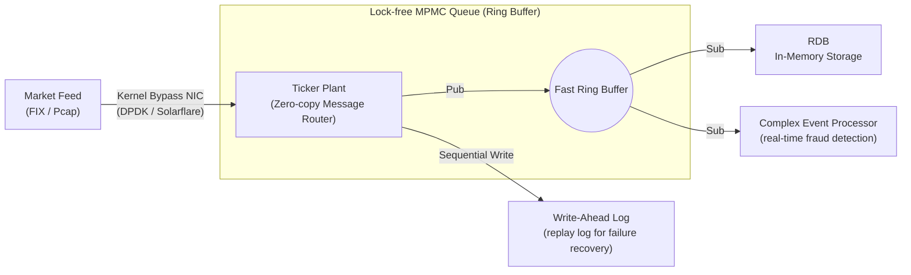

# Layer 2: Ingestion & Network Layer (Tick Plant)

This document is the detailed design specification for the **ultra-low latency routing backbone (Tick Plant)** layer, where network packets from external exchanges are received and distributed to the DB system.

## 1. Architecture Diagram

## 2. Tech Stack
- **Network packet processing:** DPDK, **UCX (Unified Communication X)** framework (open-source communication standard supporting RoCE v2, InfiniBand, AWS SRD without cloud vendor lock-in).
- **Queue and lock management:** C++20 Atomics (`std::memory_order_relaxed`), Rust (for memory safety in packet parsing).
- **Routing algorithm:** Multi-Producer Multi-Consumer (MPMC) Ring Buffer, Disruptor architecture-based event loop.

## 3. Layer Requirements
1. **Network OS Stack Bypass:** Discard the Linux TCP/IP stack and fetch data from the NIC (Network Interface Card) directly to software user-space buffers via polling, eliminating interrupt latency.
2. **Multi-Subscriber Broadcasting:** With a single packet reception, push data to multiple subscribers — storage (RDB), logging (WAL), pattern analysis (CEP) — in a zero-copy manner.
3. **Ordering Guarantee:** Every financial tick must be guaranteed strict microsecond-precision FIFO ordering and global timestamp stamping upon receipt.

## 4. Detailed Design
- **Ring Buffer-based Lock-Free Queue design:** Producer threads (Ticker Plant receive side) pre-claim the next write position on the Ring buffer via Atomic Fetch-and-Add. To fundamentally block Thread Context-switch and Mutex Lock, threads are fully pinned to a single CPU core (CPU Pinning) with spinlock or infinite polling loop.
- **Async separation of storage and parsing:** When data arrives, the Ticker Plant immediately writes to WAL in the most primitive form to ensure durability. It then immediately throws it into the RDB queue for async columnar format normalization and format assignment.
