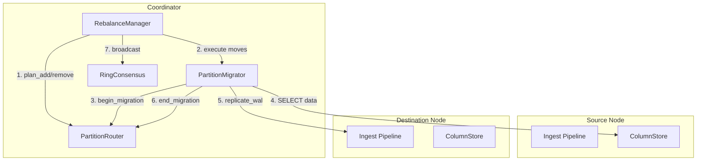
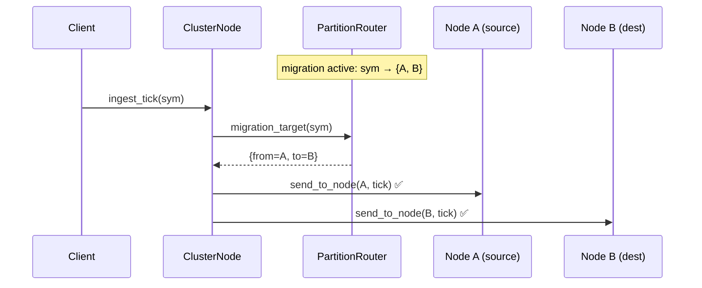
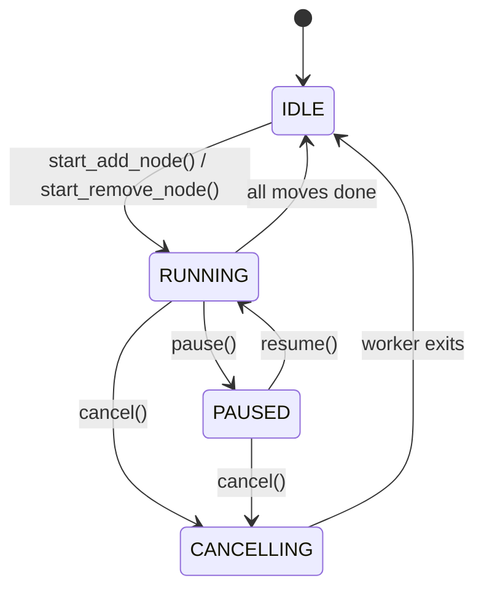
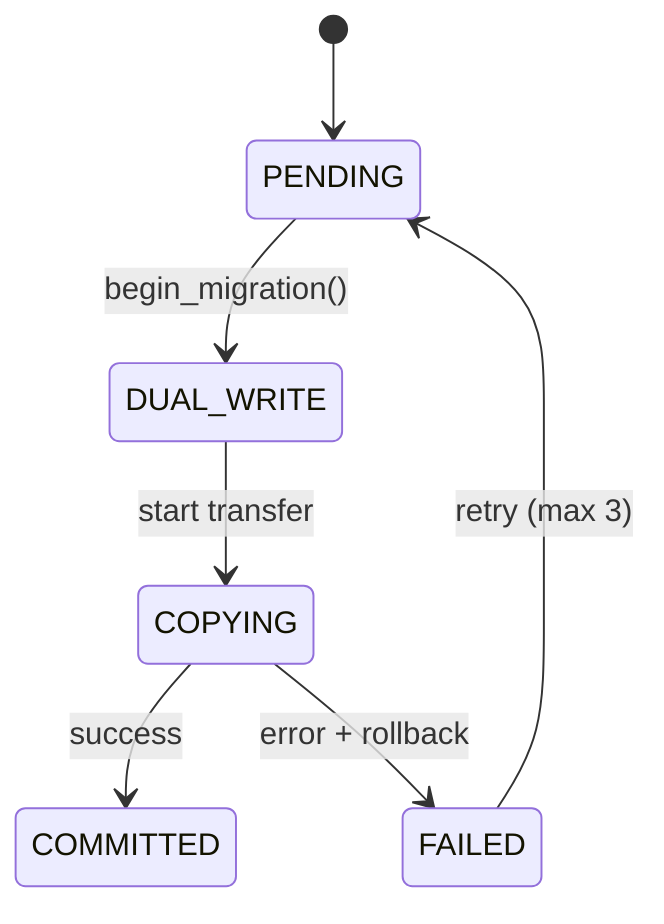
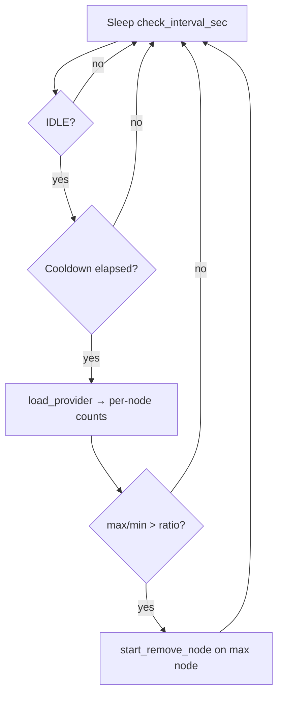

# Phase C: Distributed Memory & Cluster Architecture

> Cloud-Native horizontal scaling, swappable Transport abstraction (RDMA → CXL), lightweight Control Plane without Kubernetes

---

## 1. Architecture Overview

```
┌─────────────────────────────────────────────────┐
│         Zepto Control Plane (single binary)       │
│                                                   │
│  ┌──────────┐ ┌───────────┐ ┌────────────────┐  │
│  │ Fleet    │ │ Metadata  │ │ Health         │  │
│  │ Manager  │ │ Store     │ │ Monitor        │  │
│  │(EC2 Fleet│ │(DynamoDB) │ │(Heartbeat +    │  │
│  │ API)     │ │           │ │ Failover)      │  │
│  └──────────┘ └───────────┘ └────────────────┘  │
│  ┌──────────┐ ┌───────────┐                      │
│  │ Partition│ │ Metrics   │                      │
│  │ Router   │ │ Exporter  │                      │
│  │(Consist. │ │(Prometheus│                      │
│  │ Hashing) │ │ format)   │                      │
│  └──────────┘ └───────────┘                      │
└───────────────────┬─────────────────────────────┘
                    │ Management (gRPC / REST)
                    │
   ┌────────────────┼────────────────────┐
   │                │                    │
┌──┴───┐  ┌────────┴─────┐  ┌──────────┴──┐
│ Node1│←→│    Node2     │←→│    Node3    │  Data Plane
│ APEX │  │    APEX      │  │    APEX     │  (EFA/RDMA direct)
│ DB   │  │    DB        │  │    DB       │
└──────┘  └──────────────┘  └─────────────┘
   ↑              ↑                ↑
   └──── Placement Group (CLUSTER) ────┘
         Same AZ, same rack → lowest latency
```

---

## 2. Transport Abstraction Layer

### 2-A. Interface Design (swappable modules)

```cpp
// Compile-time dispatch — zero virtual call overhead
template <typename Impl>
class TransportBackend {
public:
    // Register memory region on a remote node
    RemoteRegion register_memory(void* addr, size_t size);

    // One-sided RDMA write (no remote CPU involvement)
    void remote_write(const void* local, RemoteRegion remote, size_t offset, size_t size);

    // One-sided RDMA read
    void remote_read(RemoteRegion remote, size_t offset, void* local, size_t size);

    // Memory fence (ordering guarantee)
    void fence();

    // Connect/disconnect nodes
    ConnectionId connect(const NodeAddress& addr);
    void disconnect(ConnectionId conn);
};
```

### 2-B. Backend Implementations

| Backend | Purpose | Latency |
|---|---|---|
| `UCXBackend` | Production — RDMA/AWS EFA/InfiniBand | ~1-15μs |
| `CXLBackend` | Next-gen — CXL 3.0 memory semantics | ~150-300ns |
| `SharedMemBackend` | Dev/test — single-machine POSIX shm | ~100ns |
| `TCPBackend` | Fallback — environments without RDMA | ~50-100μs |

### 2-C. Scope of Change for CXL Migration

```cpp
// Current (RDMA)
using ProductionTransport = TransportBackend<UCXBackend>;

// Future (CXL 3.0) — change only this one line
using ProductionTransport = TransportBackend<CXLBackend>;
```

With CXL, `remote_write/read` internally becomes a simple `memcpy`.
Hardware guarantees cache coherency, so `fence()` only needs `std::atomic_thread_fence`.

---

## 3. Control Plane Design

### 3-A. Fleet Manager (EC2 Fleet API)

```cpp
struct FleetConfig {
    // EFA-capable instances only
    std::vector<std::string> instance_types = {"r7i.8xlarge", "r8g.8xlarge"};

    // Placement Group — same rack placement
    std::string placement_group = "zepto-cluster";
    PlacementStrategy strategy = PlacementStrategy::CLUSTER;

    // Warm Pool — pre-warmed standby instances
    size_t warm_pool_size = 2;

    // Capacity Reservation
    CapacityMode capacity_mode = CapacityMode::ON_DEMAND_RESERVED;
};

class FleetManager {
    // Immediately add a node (from warm pool → seconds)
    NodeId launch_node();

    // Graceful shutdown (migrate partitions → terminate)
    void drain_and_terminate(NodeId id);

    // Maintain warm pool (booted, ZeptoDB ready state)
    void maintain_warm_pool();

    // Current cluster state
    ClusterTopology topology() const;
};
```

### 3-B. Metadata Store (DynamoDB)

```
Table: zepto-cluster-metadata

PK: "partition#{symbol_id}#{hour_epoch}"
SK: "assignment"
Attributes:
  - node_id: "node-abc123"
  - state: ACTIVE | MIGRATING | SEALED
  - arena_usage_pct: 45.2
  - created_at: 1711065600

Table: zepto-cluster-nodes

PK: "node#{node_id}"
Attributes:
  - address: "10.0.1.5:9000"
  - state: JOINING | ACTIVE | SUSPECT | DEAD | LEAVING
  - last_heartbeat: 1711065612
  - instance_type: "r7i.8xlarge"
  - partitions_count: 42
```

Why DynamoDB?
- Serverless → zero operational overhead
- Single-digit ms latency (metadata access is cold path)
- Automatic replication + high availability

### 3-C. Health Monitor (Heartbeat + Failover)

```cpp
struct HealthConfig {
    uint32_t heartbeat_interval_ms = 1000;   // every 1 second
    uint32_t suspect_timeout_ms = 3000;      // 3s no response → SUSPECT
    uint32_t dead_timeout_ms = 10000;        // 10s → DEAD
    uint32_t failover_grace_ms = 5000;       // partition migration grace period
};

// State transitions:
// ACTIVE → (3s no response) → SUSPECT → (7s more) → DEAD → failover triggered
// SUSPECT + heartbeat resumes → ACTIVE
```

Failover procedure:
1. Node declared DEAD
2. Query partition list for that node (DynamoDB)
3. Reassign partitions to next node in Consistent Hash Ring
4. Activate Warm Pool node to recover data (load from HDB)

### 3-D. Partition Router (Consistent Hashing)

```cpp
class PartitionRouter {
    // Symbol → Node routing (O(1) local hash table)
    NodeId route(SymbolId symbol) const;

    // Add node — move minimum partitions
    MigrationPlan add_node(NodeId new_node);

    // Remove node — partitions go clockwise to next node
    MigrationPlan remove_node(NodeId failed_node);

    // Virtual nodes for even distribution
    // 1 physical node = 128 virtual nodes → even data distribution
    static constexpr size_t VIRTUAL_NODES_PER_PHYSICAL = 128;
};
```

### 3-E. Ring Consensus (Distributed Synchronization)

Each node holds an independent copy of the PartitionRouter. When the ring changes (node add/remove),
all nodes' routers must be synchronized to prevent routing inconsistencies.

**Interface**: `RingConsensus` (abstract class)

```cpp
class RingConsensus {
    virtual bool propose_add(NodeId node) = 0;     // Coordinator: add node
    virtual bool propose_remove(NodeId node) = 0;   // Coordinator: remove node
    virtual bool apply_update(const uint8_t* data, size_t len) = 0;  // Follower: receive and apply
    virtual uint64_t current_epoch() const = 0;
};
```

**Default implementation**: `EpochBroadcastConsensus` (eventual consistency)

- On ring change, Coordinator calls `FencingToken::advance()` → epoch bump
- Broadcasts `RING_UPDATE` RPC to all peers (serialized RingSnapshot)
- Followers apply only when epoch ≥ last_seen (reject stale updates)
- Existing dual-write (`migrating_`) prevents data loss during transitions

**Future extension**: Replace with `RaftConsensus` implementation for strong consistency.
Can be injected at runtime via `ClusterNode::set_consensus()`.

```
Coordinator (epoch=5)
  ├─ add_node(Node4)
  ├─ epoch = 6 (advance)
  └─ broadcast RING_UPDATE{epoch=6, nodes=[1,2,3,4]}
       → Node1 ✓ (6 ≥ 5, apply)
       → Node2 ✓ (6 ≥ 5, apply)
       → Node3 ✓ (6 ≥ 5, apply)
       → Node4 ✓ (6 ≥ 0, apply)
```

---

## 4. Data Plane Design

### 4-A. Distributed Arena (Global Memory Pool)

```cpp
template <typename Transport>
class DistributedArena {
    Transport transport_;
    LocalArena local_arena_;           // Local memory (existing ArenaAllocator)
    RemoteRegion registered_region_;    // Region registered with Transport

    // Local allocation (hot path — same as before)
    void* allocate_local(size_t size);

    // Allow remote nodes to directly write to this arena (RDMA one-sided)
    RemoteRegion expose();
};
```

### 4-B. Distributed Ingestion Flow

```
Client Tick → PartitionRouter.route(symbol)
                    │
            ┌───────┴───────┐
            │ Local node?    │
            ├── YES ────────→ Local Ring Buffer → Local RDB
            │
            └── NO ─────────→ Transport.remote_write()
                              → Remote node Ring Buffer (zero-copy)
```

#### Write-path routing (devlogs 103, 111)

Feed consumers (`KafkaConsumer`, `MqttConsumer`, `OpcUaConsumer`) already
dispatch through `ClusterNode::ingest_tick` via each consumer's
`set_routing()` hook, so feed-driven ingest is partition-correct by default.

The HTTP/SQL and Python write paths previously bypassed this and wrote
directly to whichever pod received the request. **Devlog 103** added
`QueryExecutor::cluster_node_` and the routing branch in `exec_insert`;
**devlog 111** wired the adapter into the production `zepto_http_server`
binary. `QueryExecutor` holds an optional `zeptodb::cluster::ClusterNodeBase*`,
set once at startup via `set_cluster_node()`. When non-null, legacy tick-shaped
`INSERT` dispatches through `ClusterNodeBase::ingest_tick`, while declared-schema
`INSERT ... VALUES` dispatches through `ClusterNodeBase::ingest_typed_row`.
Both paths use the same `PartitionRouter` table-aware owner key. When the
pointer is null, the executor falls back to direct local pipeline ingest,
preserving single-node behaviour. The same `ingest_routed_()` pattern covers
the three Python `PyPipeline` call sites (single ingest, int batch, float batch).

In `zepto_http_server` cluster mode:

1. `CoordinatorRoutingAdapter` (devlog 111) is a non-template
   `ClusterNodeBase` implementation that reuses `QueryCoordinator`'s
   existing `PartitionRouter` + a peer `TcpRpcClient` pool. No duplicate
   `ZeptoPipeline` is constructed.
2. `RebalanceManager` now mutates `coordinator->router()` in place
   (rather than a separate `rebalance_router`), so every ring change is
   visible to the adapter's next `route()` call under the same
   `shared_mutex`.
3. A peer `TcpRpcServer` listens on `port + 100` for `TICK_INGEST` and
   `TYPED_ROW_INGEST` RPCs from other pods; callbacks write directly to the
   local pipeline (owner path). Tick callbacks mark the target schema as
   containing data and drain before returning success. Typed-row callbacks are
   synchronous because `ZeptoPipeline::ingest_typed_row()` writes directly to
   storage and updates table visibility itself. For `STRING`/`SYMBOL`
   values, typed-row RPC carries an optional string-value tail so the owner
   can bind the sender's dictionary code to the original text. This keeps the
   HTTP caller's ACK semantics aligned with local `INSERT`: once the
   forwarding pod reports success, a table-aware `SELECT` routed to the owner
   can see the row and return decoded strings through coordinator queries.
4. `zepto_data_node` is a leaf binary and does NOT wire the adapter —
   it accepts only coordinator-forwarded RPC, so wiring would
   double-route. Documented in-code.

**EKS verification (stage 3, 2026-04-30):** routing distributes writes
per hash ring (30/49/21 at N=3 vs 100/0/0 before the fix). Full Round 1
vs Round 2 comparison in `docs/bench/results_multinode.md`.

**EKS verification (2026-06-03, devlog 158):** the fast cross-arch
`--scenario all --arrow-smoke` run passed on both x86_64 and arm64 after
stable name-derived table ids, coordinator-routed HTTP `SELECT`, and
single-tick RPC drain-before-ACK were wired together. Result directory:
`/tmp/arch_fast_20260603_175848`; basic, add/remove cycle, pause/resume,
heavy query, back-to-back, and status polling all reported `PASS` with
`Symbols verified: 50/50` where integrity checks apply. The EKS harness now
requires each result file to contain an explicit scenario PASS and waits for
the x86_64/arm64 benchmark jobs by PID before comparison.

Known gap discovered during verification: DDL (`CREATE / DROP / ALTER
TABLE`) runs on a single pod only — the pod the Service LB happened to
pick — and does not propagate. Other pods keep the old `table_id`,
which causes silent `table_id` divergence when the adapter routes
INSERTs to those pods. Harmless in production (schema is
pre-provisioned), but a real issue for multi-pod test harnesses that
exercise DDL via the LB. Tracked as BACKLOG **P8-DDL-replication**.

**Resolution (2026-04-30, devlog 112):** `HttpServer` now calls
`QueryCoordinator::forward_ddl_to_remotes(sql)` after a successful
local `CREATE / DROP / ALTER TABLE`. The forward is fire-and-forget —
per-remote failures emit `ZEPTO_WARN` but never fail the client
request. DDL statements must be idempotent (`IF [NOT] EXISTS`) when
re-applied by a catch-up path on a pod that was down during the
original DDL. Strong schema consistency (Raft-based schema log,
2PC across pods) is explicitly out of scope — the benchmark-harness
use case that motivated the fix does not require it.

### 4-C. Distributed Query Flow

```
Client Query(VWAP, symbol=AAPL)
    → PartitionRouter: "AAPL is on Node2"
    → Send query request to Node2 (gRPC)
    → Node2 executes locally (SIMD vectorized)
    → Return result

// When time range spans multiple partitions:
Client Query(VWAP, symbol=AAPL, range=24h)
    → Send partial queries per partition to each node in parallel
    → Collect partial results (partial VWAP: Σpv, Σv)
    → Final aggregation at client
```

### 4-D. Replication Cluster vs MPP Cluster

This section is the product and engineering line between a replicated
single-node OLAP deployment and a ZeptoDB distributed cluster. The short
version:

- **Replication cluster**: copy the same logical database or partition log to
  one or more replicas for high availability, failover, and read redundancy.
- **MPP cluster**: split ownership of data across nodes, route writes to the
  owning shard, push query fragments to the relevant nodes, and merge partial
  results at a coordinator.
- **ZeptoDB uses both layers**: replication protects each owned shard, while
  MPP-style placement and scatter-gather let the cluster scale beyond the
  memory, ingest, and CPU limits of one machine.

Replication-only architectures are valuable when the primary problem is
availability or read fan-out. They do not by themselves remove the single-node
write owner, memory ceiling, or hot-partition CPU ceiling: each hot stream still
lands on one logical owner before it is copied elsewhere. This is the key
difference from embedded-DuckDB replica patterns, cloud-attached DuckDB
services, and Arc-style replicated OLAP deployments. Those systems can make one
database easier to serve or share, but the core scaling unit is still a
replicated database or file set.

ZeptoDB's distributed design instead makes shard ownership explicit. The
cluster routes a tick by `(table_id, symbol_id, hour_epoch)` to a partition
owner through `PartitionRouter`; that owner commits into the hot in-memory
store and WAL, and replicas receive WAL entries according to the configured
replication mode. Queries either route directly to the owner for single-shard
work or scatter to multiple nodes and merge partial results for cross-shard
work.

| Capability | Replication cluster | MPP cluster | ZeptoDB target |
|------------|---------------------|-------------|----------------|
| Primary purpose | HA, failover, read redundancy | Horizontal write, storage, and compute scale | Both: RF-based HA plus shard-aware scale-out |
| Data ownership | One logical owner copied to replicas | Partitions owned by different nodes | `PartitionRouter` owns table/symbol/time placement |
| Write scaling | Limited by primary owner or replicated log leader | Scales with number of partition owners | HTTP/SQL/Python/feed ingest route to partition owners |
| Query scaling | Read replicas help repeated local queries | Query fragments run near owned data | Direct routing for affinity queries, scatter-gather for cross-node queries |
| Failure behavior | Promote or read from replica | Reassign partitions and re-replicate | WAL replication, fencing, failover manager, live rebalancing |
| Sales message | "More available single database" | "Scale beyond one database node" | "Low-latency hot time-series shards with HA and distributed reads" |

#### Current ZeptoDB status

Implemented today:

1. `PartitionRouter` and consistent hashing provide explicit node placement.
2. Feed, HTTP/SQL, and Python ingest paths can route writes through
   `ClusterNodeBase::ingest_tick` / `ingest_tick_batch`.
3. `WalReplicator` supports async, sync, and quorum replication modes for HA.
4. `QueryCoordinator` supports direct routing and scatter-gather for supported
   distributed SELECT shapes, including partial aggregate merging.
5. Fencing tokens, coordinator HA, K8s lease support, and ring broadcasts
   protect split-brain-sensitive write paths.
6. Live rebalancing migrates partitions with dual-write during movement.
7. DDL replication is fire-and-forget for benchmark and operational
   convenience; strongly consistent schema logs remain out of scope today.

Not yet a full general-purpose MPP SQL engine:

1. The distributed planner is rule-based, not cost-based.
2. Arbitrary cross-node joins, distributed windows, DISTINCT, and full
   subquery/CTE plans still have documented gaps in Section 7.
3. Replica reads are not yet a primary query-placement policy; owners remain
   the default read target.
4. RDMA/CXL data-plane paths are architectural targets; the production-safe
   TCP/RPC path remains the current portable implementation for many flows.
5. Global transactions across shards are not part of the design. The hot path
   is per-partition durable ingest, not distributed OLTP.

#### Design north star

ZeptoDB should keep replication as a durability and availability layer, not as
the main scale-out story. The scale-out story is owned placement:

```
Client / feed
  -> route(table_id, symbol_id, hour_epoch)
  -> partition owner writes hot column store + WAL
  -> replicas receive WAL for HA
  -> query coordinator routes direct or scatter-gather reads
```

This matters most for Physical AI, IoT, market data, and observability streams:
the hard problem is continuous high-rate ingest into hot, immediately queryable
time-series partitions. Replicating one saturated node does not create more hot
write capacity; adding owners does.

The public positioning should therefore be precise:

- ZeptoDB is **not** "DuckDB with replicas".
- ZeptoDB is **not yet** a fully general distributed SQL optimizer.
- ZeptoDB **is** a shard-owned, low-latency time-series cluster with HA,
  write-sharding, selected MPP-style query paths, and a roadmap toward deeper
  distributed planning.

Future work that deepens the MPP side lives in P8/P10: RDMA remote scans,
RDMA WAL replication, replica-aware reads, cost-based distributed planning,
broadcast or replicated dimension tables, and pluggable partition strategies.

**Experiment 011 experimental boundary (updated 2026-06-21):** the Action-Outcome
distributed vendor SQL replay now passes the full strict SQL/JOIN/window
surface on a two-node 1/8 ring. Two-node row counts, routed ingest,
co-located vendor JOINs, the cross-node suppression JOIN, and cluster-mode
ROW_NUMBER/LAG all pass. The suppression table is owned by node 1 while
recommendations are owned by node 8; the coordinator handles that bounded
operational-table case by fetching both sides under a row cap, materializing
declared schemas into a temporary typed pipeline, and executing the original
hash JOIN locally. This is not a full distributed SQL optimizer: large
cross-node hash JOINs still belong to future cost-based planning.

**Experiment 012 experimental boundary (updated 2026-07-11):** symbol-less
operational tables can use explicit table-level runtime placement instead of
depending on `(stable_table_id, symbol_id=0)` ownership. `PartitionRouter`
supports default table+symbol hashing, table-only hashing, and pinned-node
placement. `POST /admin/table-placement` applies the runtime policy through
`QueryCoordinator`, while `/stats` and Prometheus expose bounded small-table
JOIN telemetry: candidates, accepted joins, row/byte/latency cap rejections,
non-cap errors, rows and estimated bytes materialized, last left/right row
counts, last estimated materialized bytes, and last latency. Experiment 012
pins Action-Outcome query/recommendation/retrieval tables to node 8 and the
suppression table to node 1, then verifies full distributed SQL/JOIN/window
replay with zero row-cap rejections and zero small-table JOIN errors. The
placement policy remains an experimental runtime path; devlog 217 adds
catalog/DDL persistence for the placement metadata. `CREATE TABLE ... WITH
(placement = hash_by_table)` and `WITH (placement = pinned_node, node_id = N)`
store placement in the schema catalog, `QueryCoordinator` re-applies catalog
placement after restart, and `POST /admin/table-placement` persists successful
admin updates to the local schema catalog. Placement is still not a
rebalance/failover policy and does not promote broad distributed JOIN/window
support.

**Bounded small-table JOIN product boundary (updated 2026-07-11):** the
coordinator-local small-table hash JOIN path is promoted for its documented
scope: simple declared-table hash JOINs over small operational/control tables.
It is controlled by `SmallTableJoinConfig`, defaults to
`BoundedBroadcast`, can be explicitly disabled, fetches each side under a
per-side row cap, rejects attempts over an estimated materialized-byte cap, and
can optionally reject attempts over a latency cap. This is a feature flag and
guardrail, not a general optimizer rule. General distributed hash JOINs,
broadcast dimension planning, and cost-based optimizer selection remain future
work.

**Cluster window materialization product boundary (updated 2026-07-11):**
coordinator-local full-data materialization is promoted for bounded declared
operational/control-table queries that require global row order or full-row
visibility, including window functions, `FIRST`/`LAST`, `COUNT(DISTINCT)`, and
non-decomposable statistical aggregates. It is controlled by
`WindowMaterializationConfig`, defaults to `BoundedCoordinatorLocal`, can be
explicitly disabled, fetches base rows under a row cap, rejects attempts over
an estimated materialized-byte cap, and can optionally reject attempts over a
latency cap. Cap failures return explicit errors; the coordinator does not
fall back to partial scatter semantics because that would produce incorrect
window state. This is still not a general MPP window optimizer.

Research-to-product promotion follows
`docs/research/EXPERIMENT_GOVERNANCE.md`. Current promotion blockers are:
an explicit optimizer/cost rule before any larger cross-node JOIN/window claim.

---

## 5. Scaling Scenarios

### Scale Out (Add Node)
```
1. FleetManager: activate node from warm pool (seconds)
2. New node → register as JOINING in Control Plane
3. PartitionRouter: add to consistent hash
4. Generate MigrationPlan → list of partitions to migrate
5. Source node → RDMA-transfer partition data to new node
6. Update DynamoDB metadata
7. New node ACTIVE → start receiving traffic
```

### Scale In (Remove Node)
```
1. Mark target node as LEAVING
2. Migrate partitions → clockwise next node in consistent hash
3. Terminate after migration confirmed
4. FleetManager: replenish warm pool
```

### Failure Recovery
```
1. Heartbeat failure → SUSPECT (3s) → DEAD (10s)
2. Partitions of failed node → reassigned to next node
3. RDB data loss → recover from HDB (S3/NVMe)
4. WAL replay to restore latest data
5. Activate warm pool node
```

### Ingest-rate HPA (P8-I4, devlog 117)

CPU/memory utilization is a poor proxy for ingest pressure: a pod can be
CPU-idle while its ring buffer is saturated, or CPU-busy on query while
ingest is light. Each pod therefore exposes
`zepto_ingest_ticks_per_sec` — an instantaneous gauge computed from the
last two `MetricsCollector` snapshots — on `GET /metrics`. Kubernetes
autoscales on this Pods metric so replica count tracks real ingest load
instead of indirect signals.

CPU and memory remain configured as `Resource` metrics on the same HPA
to act as a safety net (e.g. query-heavy or non-ingest workloads). The
Pods metric is opt-in via `autoscaling.ingestRateEnabled=true` because
it requires `prometheus-adapter` in the cluster:

```yaml
# prometheus-adapter ConfigMap (excerpt)
rules:
  - seriesQuery: 'zepto_ingest_ticks_per_sec{namespace!="",pod!=""}'
    resources:
      overrides:
        namespace: { resource: namespace }
        pod:       { resource: pod }
    name:
      matches: "^(.*)$"
      as: "$1"
    metricsQuery: |
      avg_over_time(<<.Series>>{<<.LabelMatchers>>}[1m])
```

This maps the per-pod ZeptoDB gauge onto `pods/zepto_ingest_ticks_per_sec`
so the HPA `Pods` metric (`AverageValue: <targetIngestRate>`) drives
scale-out when sustained per-pod ingest exceeds the configured target.
Standard HPA → Karpenter scale-out works unchanged: pending pods from
HPA replica increase trigger Karpenter node provisioning normally.

---

## 6. Tech Stack

| Component | Technology |
|---|---|
| Transport (current) | UCX → RDMA/AWS EFA |
| Transport (future) | CXL 3.0 (module swap) |
| Metadata | DynamoDB (serverless) |
| Node management | EC2 Fleet API + Warm Pool |
| Network placement | Placement Group (CLUSTER) |
| Inter-node RPC | gRPC (management) / RDMA (data) |
| HDB Cold Storage | S3 |
| Monitoring | Prometheus exporter → CloudWatch/Grafana |
| Configuration | S3 JSON or DynamoDB |

---

## 7. Implementation Order

### Phase C-1: Transport Abstraction
- `TransportBackend` interface
- `SharedMemBackend` (for testing)
- `UCXBackend` (production)
- Extend existing ArenaAllocator → DistributedArena

### Phase C-2: Cluster Core
- `PartitionRouter` (consistent hashing)
- `HealthMonitor` (heartbeat)
- `ClusterNode` (node process)
- Local 2-node test (SharedMem)

### Phase C-3: AWS Integration
- `FleetManager` (EC2 Fleet API)
- DynamoDB metadata
- Placement Group configuration
- EFA real-world testing

### Phase C-3 MVP: QueryCoordinator + TCP RPC ✅ Completed (2026-03-22)
- `QueryCoordinator` — two-tier routing:
  - Tier A: `WHERE symbol = N` (integer) → consistent-hash direct route to owning node
  - Tier A: `WHERE symbol = 'AAPL'` (string) → currently falls through to Tier B (scatter-gather); each node resolves string via local dictionary
  - Tier B: scatter-gather to all nodes → partial aggregation merge
- `TcpRpcServer` / `TcpRpcClient` — POSIX socket transport
  - 24-byte `RpcHeader` (magic, type, request_id, payload_len, epoch)
  - Binary `QueryResultSet` wire format (error, column names/types, packed int64 rows,
    plus an optional decoded string tail for `SYMBOL`/`STRING` columns so
    node-local dictionary codes do not leak through distributed concat merge)
  - Binary `TypedRowMessage` write format for `TYPED_ROW_INGEST`, with a
    backwards-compatible optional tail carrying original `SYMBOL`/`STRING`
    text by column index; receivers reject inconsistent dictionary code/text
    bindings instead of silently corrupting semantic values
  - Connection pooling (acquire/release, MSG_PEEK liveness, max 4 idle)
- `partial_agg.h` — merge strategies:
  - `SCALAR_AGG`: SQL-AST-driven per-column merge (SUM/COUNT=add, MIN=min, MAX=max, AVG=SUM/COUNT rewrite)
  - `MERGE_GROUP_BY`: re-aggregate same key buckets across nodes (xbar time bars)
  - `CONCAT`: plain rows or GROUP BY with symbol affinity (no key overlap);
    preserves decoded `SYMBOL`/`STRING` strings from local dictionaries and
    remote RPC string tails
  - Strategy detected from SQL AST (not column names — executor returns raw names)
- 25 tests: RpcProtocol (5), PartialAgg (11), TcpRpc (4), QueryCoordinator (5)

### Phase C-3.5: Cluster Integrity ✅ Completed (2026-03-23)

**Problem:** Multiple components maintained independent state that could desync,
and split-brain scenarios had incomplete protection.

**Changes:**

1. **Unified PartitionRouter** — `QueryCoordinator::set_shared_router()` accepts
   an external `PartitionRouter*` + `shared_mutex*`. `ClusterNode::connect_coordinator()`
   injects its router into the coordinator. Eliminates dual-router desync.
   - Fallback: standalone QueryCoordinator uses its own internal router (backward compat)

2. **FencingToken in RPC protocol** — `RpcHeader` extended from 16 → 24 bytes with
   `uint64_t epoch` field. `TcpRpcServer::set_fencing_token()` enables write validation.
   - `TICK_INGEST` / `WAL_REPLICATE` with `epoch < last_seen` → rejected (status=0)
   - `epoch=0` → bypasses fencing (backward compatible with legacy clients)
   - Split-brain defense: stale coordinator's writes are rejected after new coordinator
     advances the epoch via `FencingToken::advance()`

3. **CoordinatorHA auto re-registration** — on standby→active promotion, all nodes
   in `registered_nodes_` are automatically replayed into the coordinator as remote
   endpoints. No manual callback wiring needed for basic functionality.

4. **ComputeNode merge logic** — `ComputeNode::execute()` now delegates to an internal
   `QueryCoordinator` instead of naive concat. Correctly handles GROUP BY, scalar
   aggregates, AVG rewrite, and ASOF JOIN routing.
   - Bug fix: `SELECT *` was misclassified as `SCALAR_AGG` (treated `is_star` as aggregate)

**Split-brain defense status:**

| Scenario | Defense | Status |
|----------|---------|--------|
| Stale coordinator TICK_INGEST | RpcHeader.epoch + FencingToken.validate() | ✅ Tested |
| Stale coordinator WAL_REPLICATE | Same | ✅ Tested |
| K8s Lease takeover detection | K8sLease.force_holder() → on_lost callback | ✅ Tested |
| FencingToken monotonic gate | epoch < last_seen → reject | ✅ Tested |
| Legacy client (epoch=0) | Bypasses fencing (backward compat) | ⚠️ By design |
| SQL_QUERY from stale coordinator | No fencing (reads are safe) | ⚠️ By design |

**Tests added:** 9 new tests (SharedRouter ×2, FencingRpc ×2, CoordinatorHA ×1, SplitBrain ×4)

**Related code:**
- `include/zeptodb/cluster/query_coordinator.h` — shared router API
- `include/zeptodb/cluster/rpc_protocol.h` — 24-byte RpcHeader
- `include/zeptodb/cluster/tcp_rpc.h` — fencing token + epoch on client/server
- `include/zeptodb/cluster/cluster_node.h` — `connect_coordinator()`
- `src/cluster/coordinator_ha.cpp` — auto re-registration on promote

### Phase C-3.6: Distributed Query Correctness ✅ Partial (2026-03-23)

**Completed:**
- VWAP distributed decomposition: `VWAP(p,v)` → `SUM(p*v), SUM(v)` rewrite → `SUM_PV/SUM_V` reconstruction
- ORDER BY + LIMIT post-merge: coordinator sorts merged results and truncates after all merge strategies

**Remaining query-level gaps:**

| Gap | Status | Notes |
|-----|--------|-------|
| HAVING distributed | TODO | Apply after GROUP BY merge at coordinator |
| DISTINCT distributed | TODO | Dedup at coordinator after concat |
| Window functions distributed | Implemented for fetch-and-compute | Coordinator fetches all rows, materializes declared tables through typed rows, then executes locally |
| FIRST/LAST distributed | TODO | Timestamp comparison across nodes |
| COUNT(DISTINCT) distributed | TODO | HyperLogLog or exact dedup |
| Subquery/CTE distributed | TODO | Cross-node CTE reference |
| Multi-column ORDER BY | TODO | Extend sort to composite key |

**Remaining infrastructure gaps:**

| Gap | Status | Notes |
|-----|--------|-------|
| Cancel propagation | TODO | Coordinator timeout → cancel RPC to nodes |
| Partial failure policy | TODO | Some nodes fail: partial result vs error |
| In-flight query safety | TODO | Node add/remove during scatter → race |
| Distributed query timeout | TODO | Remote-side timeout enforcement |

**Completed infrastructure gaps:**

| Gap | Resolved In | Notes |
|-----|-------------|-------|
| Dual-write during migration | devlog 055 | Wired into `ClusterNode::ingest_tick()` via `migration_target()` |

**Remaining precision gaps:**

| Gap | Status | Notes |
|-----|--------|-------|
| AVG int64 truncation | TODO | Float AVG loses precision via integer division |
| VWAP int64 overflow | TODO | SUM(price*volume) can overflow for large datasets |

### Phase C-4: Distributed Query
- UCX scatter-gather (replace TCP with RDMA for production)
- Consistent hashing for live node add/remove
- Replication factor 2 with automatic failover
- Multi-node benchmarks

---

## 8. Core Design Principles

1. **No indirect calls in hot path** — template dispatch, inline
2. **Control Plane != Data Plane** — management can be slow, data must be μs
3. **Transport swap = 1 line change** — painless RDMA → CXL migration
4. **No Kubernetes** — Fleet API + DynamoDB is sufficient
5. **Warm Pool** — add nodes in seconds, no boot wait
6. **Consistent Hashing** — minimum partition movement on node changes

---

## 9. Live Rebalancing (RebalanceManager)

Implemented in `include/zeptodb/cluster/rebalance_manager.h` + `src/cluster/rebalance_manager.cpp`.
Full implementation details: [`docs/devlog/055_live_rebalancing.md`](../devlog/055_live_rebalancing.md)

### Overview



### Dual-Write During Migration

`ClusterNode::ingest_tick()` checks `PartitionRouter::migration_target()` before normal routing. If a symbol is migrating, ticks are sent to both source and destination nodes (dual-write). This prevents data loss during partition moves.



### RebalanceManager State Machine



- `start_add_node(NodeId)` — plans migration via `router_.plan_add()`, executes in background thread
- `start_remove_node(NodeId)` — plans migration via `router_.plan_remove()`, executes in background thread
- Each move is delegated to `PartitionMigrator::execute_plan()` (handles dual-write begin/end, copy, retry)
- Supports pause/resume/cancel via `std::atomic<RebalanceState>` + condition variable
- Checkpoint support via `PartitionMigrator::set_checkpoint_path()`

### Per-Move State Machine



### 9.1 Load-Based Auto-Trigger (RebalancePolicy)

`RebalancePolicy` enables automatic rebalancing when cluster load becomes imbalanced.

```cpp
struct RebalancePolicy {
    bool     enabled = false;
    double   imbalance_ratio = 2.0;    // trigger if max/min partition count > 2x
    uint32_t check_interval_sec = 60;
    uint32_t cooldown_sec = 300;       // min time between auto-rebalances
};
```

A background `policy_thread_` periodically calls a `LoadProvider` callback to get per-node partition counts. If `max_count / min_count > imbalance_ratio` and the cooldown has elapsed, it calls `start_remove_node()` on the most overloaded node.



### 9.2 Admin HTTP API

Five REST endpoints for rebalance control, registered in `HttpServer::setup_admin_routes()`:

| Endpoint | Method | Description |
|----------|--------|-------------|
| `/admin/rebalance/status` | GET | JSON status snapshot |
| `/admin/rebalance/start` | POST | Start add_node or remove_node |
| `/admin/rebalance/pause` | POST | Pause current rebalance |
| `/admin/rebalance/resume` | POST | Resume paused rebalance |
| `/admin/rebalance/cancel` | POST | Cancel current rebalance |

All require admin role. Returns 503 if `RebalanceManager` is not configured.
Full API reference: [`docs/api/HTTP_REFERENCE.md`](../api/HTTP_REFERENCE.md#admin-rebalance)

### Partial-Move API

In addition to full add/remove node operations, `start_move_partitions()` accepts an explicit list of `{symbol, from, to}` moves. This enables:
- Hot-symbol rebalancing without draining an entire node
- Manual capacity planning and partition placement
- Surgical moves for maintenance windows

Partial moves reuse the same `start_plan()` → `run_loop()` execution path. The key difference: `action_` is set to `NONE`, so no `RingConsensus` broadcast occurs after completion (the ring topology doesn't change — only data placement does).

---

## 10. Pod placement for horizontal scale-out

Horizontal scale-out on Kubernetes only delivers linear ingest gain when each replica
lands on a distinct node. The Helm chart therefore defaults to **hard** podAntiAffinity
(`podAntiAffinity.required: true`, `topologyKey: kubernetes.io/hostname`) — a soft
`preferred*` preference was shown to silently co-locate replicas when HPA scaled past
the current node count, halving ingest CPU scaling and destroying failure isolation.
The default is complemented by `topologySpreadConstraints` with `maxSkew: 1` so that
even when `replicas > nodes` is legitimate (e.g. during a brief HPA spike ahead of
Karpenter node provision), pods are distributed as evenly as possible rather than
clustering on whichever node has headroom.

Dev clusters with tight node counts can flip `podAntiAffinity.required: false` to
regain the soft behaviour. Full sizing guidance and sector-specific overlays live in
`docs/operations/KUBERNETES_OPERATIONS.md` → "Sizing and placement for enterprise
factory workloads". Implementation details and verification are captured in
`docs/devlog/104_pod_placement_hardening.md`.
