# Devlog 055: Live Rebalancing

Date: 2026-04-11

## Summary

Implemented zero-downtime live partition rebalancing for ZeptoDB cluster:

1. **Dual-write bug fix** — `ClusterNode::ingest_tick()` now checks `migration_target()` during ingestion, sending ticks to both source and destination nodes during migration. Previously this API existed but was dead code, causing a data loss window.

2. **RebalanceManager** — new orchestrator class that plans and executes partition migrations when nodes are added or removed, with pause/resume/cancel support.

---

## Architecture Overview

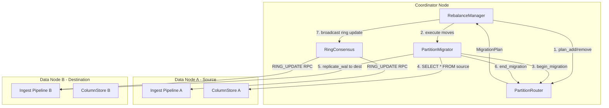

---

## Mechanism Detail

### The Dual-Write Problem (Pre-Fix)

Before this change, partition migration had a data loss window:

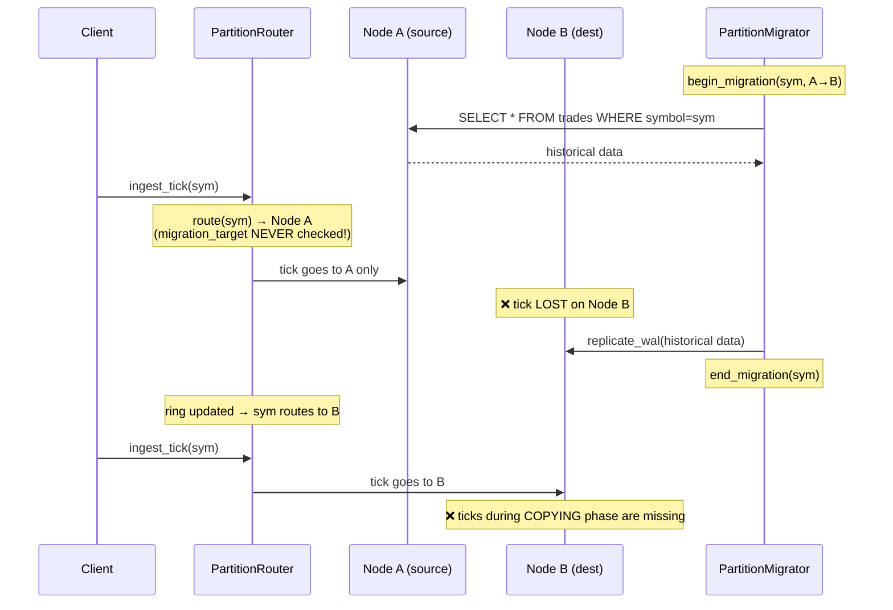

### The Dual-Write Fix (Post-Fix)

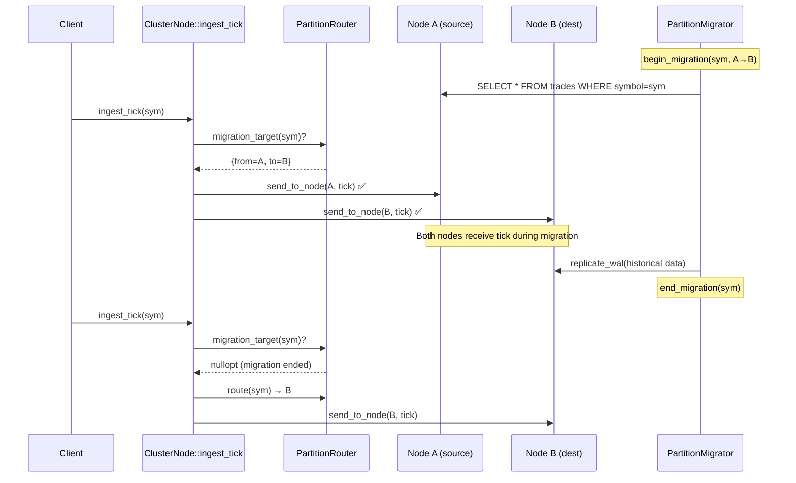

### Locking Strategy

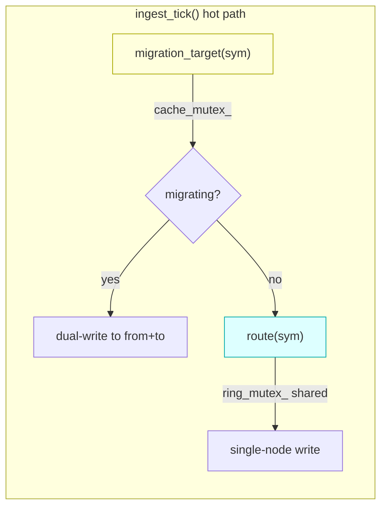

Key: `migration_target()` uses `cache_mutex_` (lightweight, no contention with ring reads). `route()` uses `ring_mutex_` (shared_lock). These are independent locks — no ordering dependency.

---

## RebalanceManager State Machine

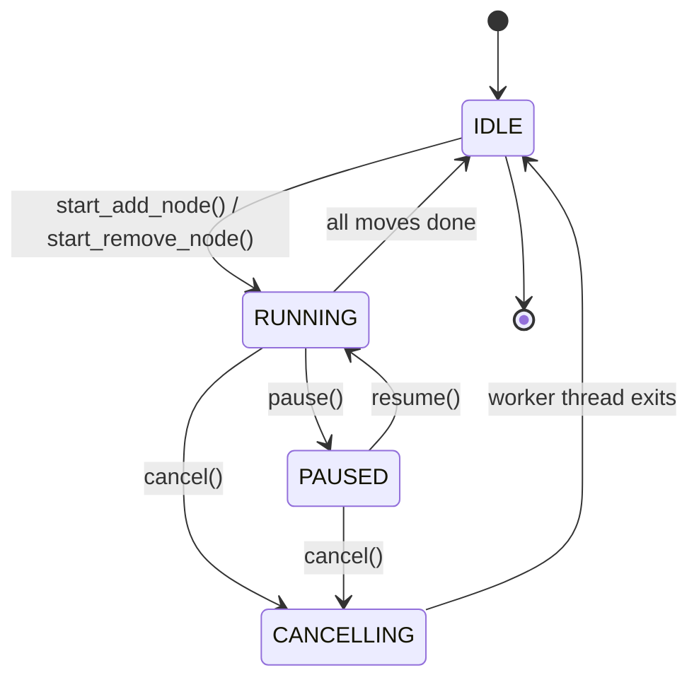

State transitions use `std::atomic<RebalanceState>` with `compare_exchange_strong/weak`:
- `start_plan()`: CAS `IDLE → RUNNING` (rejects if already running)
- `pause()`: CAS `RUNNING → PAUSED`
- `resume()`: CAS `PAUSED → RUNNING`
- `cancel()`: CAS loop from `RUNNING|PAUSED → CANCELLING`

---

## Scale-Out Flow (Add Node)

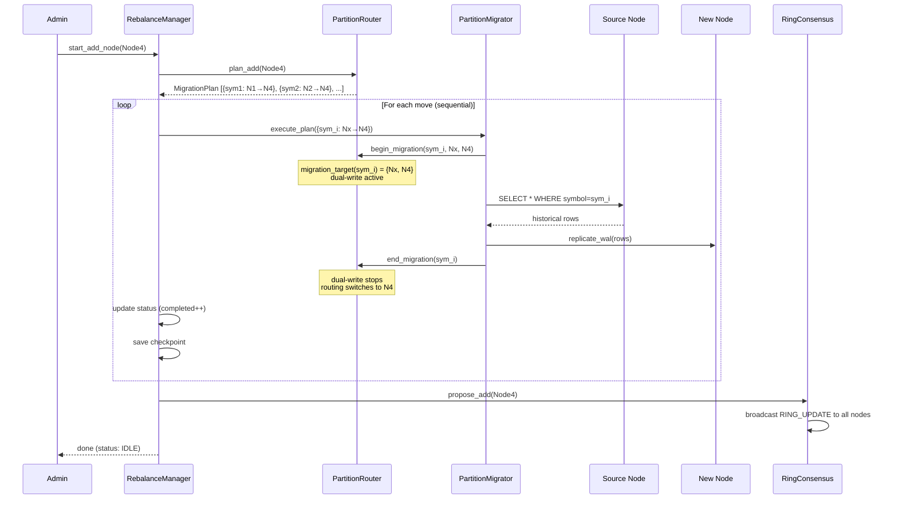

---

## Scale-In Flow (Remove Node)

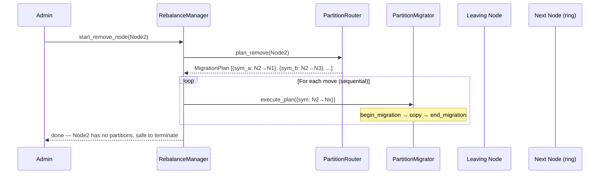

---

## Per-Move State Machine (PartitionMigrator)

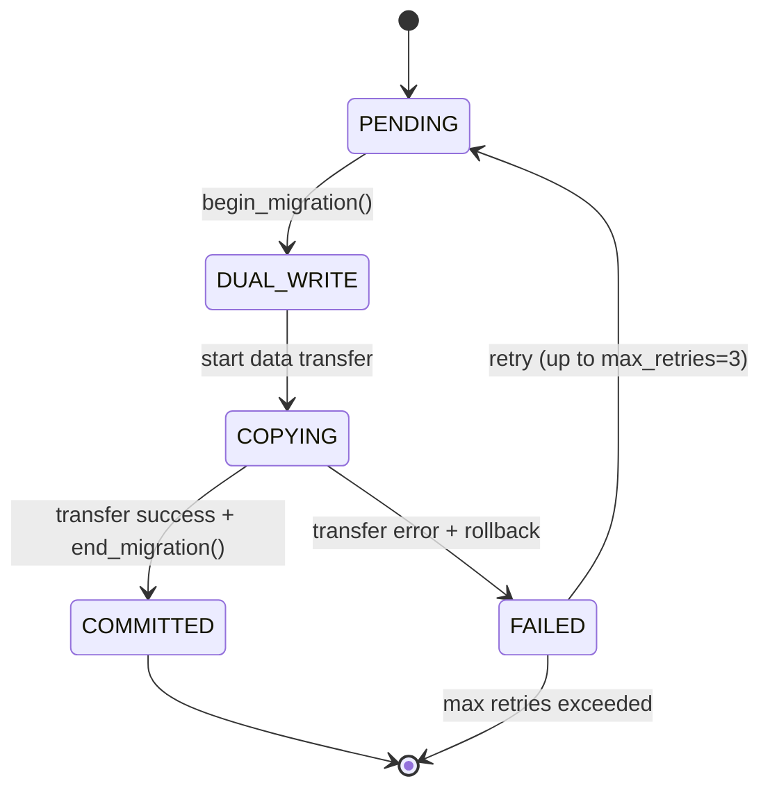

Rollback on failure: `DELETE FROM trades WHERE symbol=X` on destination node, then `end_migration()` to stop dual-write.

---

## Crash Recovery

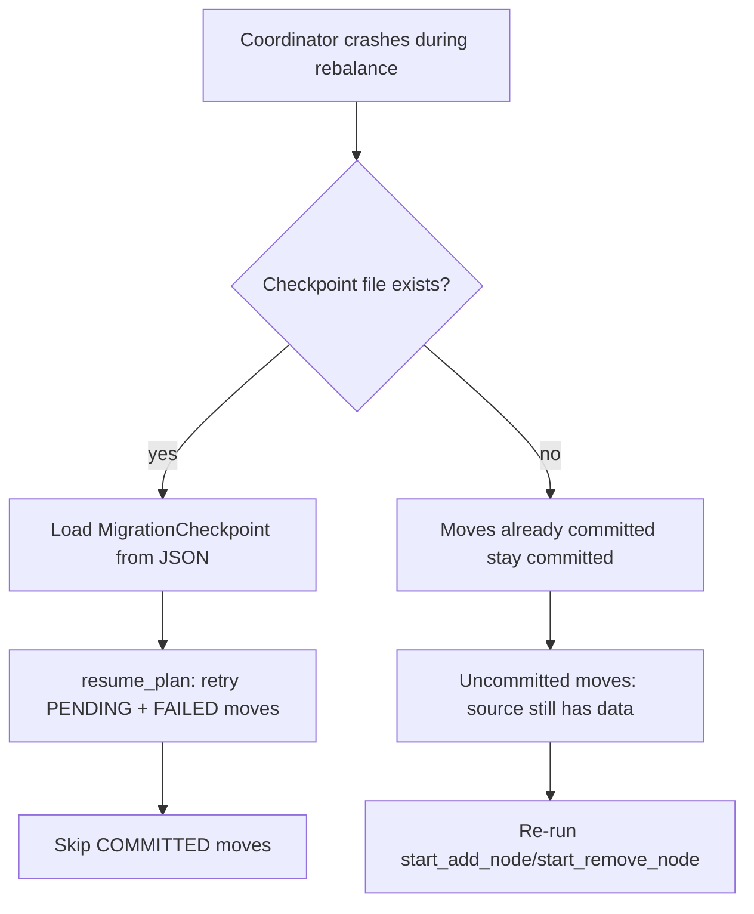

Checkpoint is saved to `{checkpoint_dir}/rebalance.json` after each move completes. Format:
```json
[
  {"symbol":42, "from":1, "to":4, "state":3, "error":"", "rows":15000, "attempts":1},
  {"symbol":99, "from":2, "to":4, "state":0, "error":"", "rows":0, "attempts":0}
]
```
State values: 0=PENDING, 1=DUAL_WRITE, 2=COPYING, 3=COMMITTED, 4=FAILED

---

## Ingestion Hot Path Impact

| Path | Overhead | Notes |
|------|----------|-------|
| No migration active | ~50ns | Single `cache_mutex_` lock + map lookup (miss) |
| Migration active (dual-write) | ~2× ingest latency | Two `send_to_node()` calls instead of one |
| Migration just ended | ~50ns | `migration_target()` returns nullopt, falls through to `route()` |

The `migration_target()` check is O(1) hash map lookup under `cache_mutex_`. This is the same mutex used by `route()` for cache reads, so no additional lock is introduced.

---

## Configuration

```cpp
struct RebalanceConfig {
    std::string checkpoint_dir;  // for crash recovery (empty = no checkpoint)
};
```

Future reserved (not yet implemented):
- `max_concurrent_moves` — parallel move execution
- `move_timeout_sec` — per-move timeout
- `bandwidth_limit_mbps` — throttle data transfer

---

## Test Coverage

| Test | What it verifies |
|------|-----------------|
| `DualWriteIngestTest` | Ticks written to both nodes during migration |
| `DualWriteNormalPath` | Normal single-node routing when no migration |
| `RebalanceAddNode` | Plan generation + execution for scale-out |
| `RebalanceRemoveNode` | Plan generation + execution for scale-in |
| `RebalancePauseResume` | Pause/resume state transitions |
| `RebalanceCancel` | Clean cancellation mid-rebalance |
| `RebalanceAlreadyRunning` | Rejection of concurrent rebalance |
| `RebalanceStatusTracking` | Progress reporting accuracy |

---

## Phase 3: Load-Based Auto-Trigger (RebalancePolicy)

Added automatic rebalancing based on cluster load imbalance.

### Configuration

```cpp
struct RebalancePolicy {
    bool     enabled = false;
    double   imbalance_ratio = 2.0;    // trigger if max/min partition count > 2x
    uint32_t check_interval_sec = 60;  // how often to check
    uint32_t cooldown_sec = 300;       // min time between auto-rebalances
};
```

### Policy Check Loop

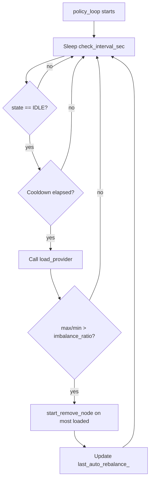

The `LoadProvider` callback is set externally (e.g., by `ClusterNode`) and returns `vector<pair<NodeId, size_t>>` — per-node partition counts. The policy thread sleeps between checks and uses `condition_variable::wait_for` for clean shutdown.

### Integration

```cpp
// In ClusterNode or coordinator setup:
rebalance_mgr.set_load_provider([&router]() {
    return router.partition_counts();  // per-node counts
});
rebalance_mgr.start_policy();
```

---

## Phase 4: Admin HTTP API

Added 5 REST endpoints for rebalance management via the HTTP server.

### Endpoints

| Endpoint | Method | Description |
|----------|--------|-------------|
| `/admin/rebalance/status` | GET | Current rebalance status |
| `/admin/rebalance/start` | POST | Start rebalance (add_node or remove_node) |
| `/admin/rebalance/pause` | POST | Pause current rebalance |
| `/admin/rebalance/resume` | POST | Resume paused rebalance |
| `/admin/rebalance/cancel` | POST | Cancel current rebalance |

### Admin API Flow

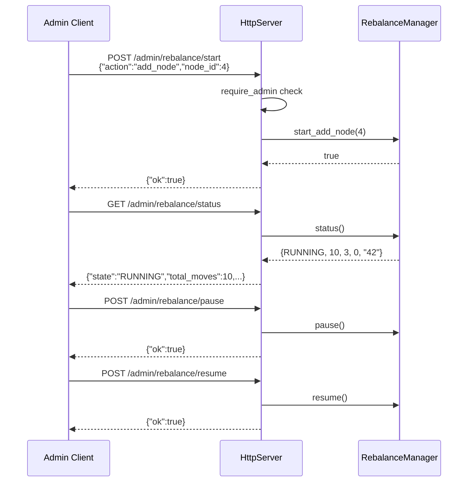

All endpoints require admin role. Returns 503 if `rebalance_manager_` is null (not in cluster mode).

---

## Phase 5: RingConsensus Broadcast After Rebalance

Fixed missing ring broadcast: after `RebalanceManager` completes all partition moves, it now calls `RingConsensus::propose_add()` or `propose_remove()` to synchronize the hash ring across all cluster nodes.

### Problem

The devlog 055 design diagram showed step 7 (`RM → RC: propose_add(Node4)` → `RC → broadcast RING_UPDATE to all nodes`), but the actual implementation never called `RingConsensus`. Only the coordinator's local `PartitionRouter` was updated via `end_migration()`. Other data nodes kept stale ring state.

### Fix

- `RebalanceManager` now accepts a `RingConsensus*` via `set_consensus()`
- `start_add_node()` / `start_remove_node()` record the action type and target node ID
- `run_loop()` calls `consensus_->propose_add()` or `propose_remove()` after all moves complete (skipped on cancel or zero completed moves)
- Action state is reset to `NONE` after broadcast

### Files Changed

| File | Change |
|------|--------|
| `include/zeptodb/cluster/rebalance_manager.h` | Added `RingConsensus` forward decl, `RebalanceAction` enum, `set_consensus()`, `consensus_`/`action_`/`action_node_` members |
| `src/cluster/rebalance_manager.cpp` | Save action context in `start_add/remove_node()`, broadcast in `run_loop()` after moves, reset in Done block |
| `tests/unit/test_rebalance.cpp` | `MockRingConsensus` + 3 tests (broadcast on add, broadcast on remove, no broadcast on cancel) |

---

## Files Changed

| File | Change |
|------|--------|
| `include/zeptodb/cluster/cluster_node.h` | Dual-write in `ingest_tick()`, `send_to_node()` helper, `#include logger.h` |
| `include/zeptodb/cluster/rebalance_manager.h` | RebalanceManager header — added `RebalancePolicy`, `LoadProvider`, `start_policy()`/`stop_policy()`, `RingConsensus` forward decl, `RebalanceAction` enum, `set_consensus()` |
| `src/cluster/rebalance_manager.cpp` | RebalanceManager impl — added `policy_loop()`, `set_load_provider()`, `start_policy()`/`stop_policy()`, ring broadcast in `run_loop()` |
| `include/zeptodb/server/http_server.h` | Added `set_rebalance_manager()`, `rebalance_mgr_` member |
| `src/server/http_server.cpp` | Added 5 `/admin/rebalance/*` endpoints |
| `tests/unit/test_rebalance.cpp` | 8 tests |
| `tests/CMakeLists.txt` | Added test_rebalance.cpp |
| `CMakeLists.txt` | Added rebalance_manager.cpp to zepto_cluster |
| `docs/BACKLOG.md` | Marked live rebalancing + dual-write as done |
| `docs/COMPLETED.md` | Added Phase 3 + Phase 4 entries |
| `docs/design/phase_c_distributed.md` | Added Section 9 subsections: load-based policy, admin API |
| `docs/api/HTTP_REFERENCE.md` | Added `/admin/rebalance/*` endpoints |
| `docs/devlog/055_live_rebalancing.md` | Added Phase 3 + Phase 4 sections |
